# Chain Explosion Model Simulations / 链式爆炸模型数值实验

**Repository / 仓库：** [github.com/tomnattle/chain-explosion-model](https://github.com/tomnattle/chain-explosion-model)

A local, discrete, causal propagation model for wave-like phenomena, double-slit interference, which-way measurement, delayed choice, and quantum-like entanglement.

一个局域、离散、满足因果律的格点传播模型，用于模拟类波动行为、双缝干涉、路径探测、延迟选择与类量子纠缠现象。

```bash
git clone https://github.com/tomnattle/chain-explosion-model.git
cd chain-explosion-model
```

---

## Core predictions / 核心理论预言

（以下为该格点模型在文档层面的归纳，具体数值以脚本与参数为准。）

- Interference visibility decays with propagation distance (**distinctive testable prediction** in this model).
- Entangled wave packets can maintain **phase correlation** while **energy decays** (e.g. with distance / attenuation).
- **Measurement** is implemented as **local absorption**; the codebase does not assume nonlocal collapse—you compare outcomes to collapse / nonlocal narratives in the literature.

- 干涉条纹对比度**随传播距离衰减**（在本模型中可作为**可对照实验**讨论的重点）。
- 纠缠式波包：**相位关联**与**能量衰减**可在同一模拟中区分考察。
- **测量**在实现上为**局域吸收**；代码不预设非定域坍缩，便于与文献中的「坍缩/非定域」叙述对照。

---

## Overview / 简介

This repository implements a **2D discrete lattice propagation model** (“chain explosion”): energy propagates step-by-step to neighbors with directional coupling, attenuation, and optional phase evolution. Scripts replay a sequence of quantum-optics–style gedanken setups:

- Double-slit interference; visibility vs. distance and vs. lateral coupling **S**
- Which-way–style absorption; finite-size detectors; delayed-choice insertion
- Split wave packets with optional phase fields and distance scans (**all hot loops are Numba JIT** via `chain_explosion_numba.py`)

本仓库在二维离散网格上实现**链式爆炸模型**：能量分步向邻域传播，含方向耦合、衰减与可选相位。脚本对应一系列**量子光学思想实验风格**的数值实验：

- 双缝干涉；对比度随距离、随侧向耦合 **S** 的变化
- 路径信息式吸收；有限探测器；中途插入吸收体（延迟选择）
- 波包分裂 + 相位场 + 距离扫描；**格点传播核心均在 Numba 中 JIT**（见 `chain_explosion_numba.py`）

---

## Scripts / 脚本说明

| File | 中文说明 | English |
|------|----------|---------|
| `ce_00_double_slit_demo.py` | 基础双缝演示；能量场与屏幕条纹。 | Baseline double-slit demo; field and screen pattern. |
| `ce_01_visibility_vs_screen_distance.py` | 多距离屏幕：对比度扫描 → **`interference_decay.png`** | Visibility vs. screen distance → **`interference_decay.png`** |
| `ce_02_double_slit_screen_statistics.py` | 单次运行；屏幕能量、峰谷与对比度等（终端输出为主，默认不写 PNG）。 | Single run; screen statistics (mainly console; no default PNG). |
| `ce_03_visibility_vs_side_coupling_S.py` | 扫描侧向强度 **S** → **`V_vs_S.png`** | Scan lateral **S** → **`V_vs_S.png`** |
| `ce_04_measurement_absorption_at_slit.py` | 缝后无/部分/完全吸收对比 → **`measurement_effect.png`** | None / partial / full absorption → **`measurement_effect.png`** |
| `ce_05_finite_absorber_detector.py` | 有限圆形吸收体 → **`finite_absorber.png`** | Finite circular absorber → **`finite_absorber.png`** |
| `ce_06_delayed_choice_absorber.py` | 传播中途插入吸收体 → **`delayed_choice.png`** | Mid-run absorber → **`delayed_choice.png`** |
| `ce_07_measurement_phase_diagram_scan.py` | 位置/尺度/吸收率扫描 → **`measurement_phase_diagram.png`** | Position / size / absorption scan → **`measurement_phase_diagram.png`** |
| `ce_08_entanglement_split_wavepackets.py` | 分裂波包与探测器 → **`entanglement_simulation.png`** | Split packets & detectors → **`entanglement_simulation.png`** |
| `ce_09_entanglement_with_phase_field.py` | 能量 + 相位 → **`entanglement_with_phase.png`** | Energy + phase field → **`entanglement_with_phase.png`** |
| `ce_10_entanglement_distance_scan.py` | 距离扫描（步内能量归一化）→ **`ce_10_entanglement_scan.png`** | Distance scan (per-step energy renormalization) → **`ce_10_entanglement_scan.png`** |
| `chain_explosion_numba.py` | **共享模块**：双缝 / 缝后吸收 / 吸收掩模 / 分裂与相位传播的 `@jit(nopython=True)` 内核。 | **Shared** `@jit(nopython=True)` kernels for all propagation variants. |

> **Note / 说明：** 旧目录中 `s5.py` 与 `s4.py` 内容相同，已删去冗余；功能由 `ce_04_...` 保留。原 `main.py`、`s1.py`–`s4.py`、`s4.1.py`、`s6.py`–`s10.py` 已统一重命名为上表 `ce_*` 系列。  
> Legacy duplicate `s5.py` was removed (identical to `s4.py`); `main.py` and `s*.py` are renamed into the `ce_*` series above.

## Per-script AI summary / 各脚本原理与假设（AI 速览，与 experiment_dossier 同步）

以下便于自动化工具与 AI 在不打开 `.py` 时理解程序意图；`python run_unified_suite.py` 生成的归档图下会重复注入对应条目。

### `ce_00_double_slit_demo.py`

**原理（AI 速览）：**
- **目的：** 双缝几何下展示离散链式传播能否形成类干涉屏上分布。
- **机制：** Numba 核 `chain_explosion_numba.propagate_double_slit`：每步将格点能量按 A/S/B 权重分到邻格并乘 λ；挡板布尔掩模开孔。

**假设：**
- 二维矩形网格足够大，边界效应未单独建模。
- 单点源初始化；未引入色散/色散关系。
- 干涉可读性依赖人为选取的 A,S,B,λ 与缝几何。

### `ce_01_visibility_vs_screen_distance.py`

**原理（AI 速览）：**
- **目的：** 扫描屏距（传播步数proxy），记录干涉对比度 V 是否随距离变化。
- **机制：** 同一双缝设置，多个 SCREEN_X；每距离同步长传播；本地计算 V。

**假设：**
- 对比度定义与脚本内 compute_visibility 一致。
- 总能量未归一化时数值量级会爆涨；V 仍基于相对起伏。

### `ce_02_double_slit_screen_statistics.py`

**原理（AI 速览）：**
- **目的：** 单次长跑后做屏上峰谷统计、对称性、对比度，定量描述条纹质量。
- **机制：** 与 ce_00 同核；额外在 Python 层找局部极大与简化的 V。

**假设：**
- 主峰判定用阈值 mean*0.5；启发式非唯一。

### `ce_03_visibility_vs_side_coupling_S.py`

**原理（AI 速览）：**
- **目的：** 在固定几何下扫侧向耦合 S，观察 V–S 关系。
- **机制：** 对每个 S 重跑传播至 SCREEN_X，计算 V。

**假设：**
- S 列表离散；未做连续外推。
- 其余 A,B,λ 固定。

### `ce_04_measurement_absorption_at_slit.py`

**原理（AI 速览）：**
- **目的：** 缝后不同吸收强度对屏条纹的对比示意（测量/路径信息 toy）。
- **机制：** 使用 `propagate_double_slit_slit_absorb`（缝邻域按比率抽走能量）。

**假设：**
- 吸收率离散档位
- 未建模探测器量子效率谱

### `ce_05_finite_absorber_detector.py`

**原理（AI 速览）：**
- **目的：** 有限圆形吸收体（路径探测）对场的扰动示意。
- **机制：** `propagate_double_slit_absorber_mask` + 圆掩模。

**假设：**
- 圆域吸收简化为每步乘法抽能

### `ce_06_delayed_choice_absorber.py`

**原理（AI 速览）：**
- **目的：** 中途开启/插入吸收影响的 thought-experiment 风格模拟。
- **机制：** 分阶段传播参数或掩模变更。

**假设：**
- 时间步与「延迟」仅为离散步数隐喻

### `ce_07_measurement_phase_diagram_scan.py`

**原理（AI 速览）：**
- **目的：** 多参数格子扫描测量「相图」式拼图。
- **机制：** 嵌套循环改变吸收体位置/尺度/率并成像。

**假设：**
- 扫描网格稀疏；非物理参数空间完备搜索

### `ce_08_entanglement_split_wavepackets.py`

**原理（AI 速览）：**
- **目的：** 分裂波包 + 双探测器几何，示意「纠缠风格」能量分配。
- **机制：** `propagate_split_energy` 将能量分到两条支路格点。

**假设：**
- 「纠缠」仅为同一网格上演化规则，非希尔伯特张量积形式。

### `ce_09_entanglement_with_phase_field.py`

**原理（AI 速览）：**
- **目的：** 在能量之外维护相位场，观察相干/相关可视化。
- **机制：** `propagate_split_phase` 同时更新相位。

**假设：**
- 相位离散更新规则为模型定义，非推导自 QM 相位手册

### `ce_10_entanglement_distance_scan.py`

**原理（AI 速览）：**
- **目的：** 纠缠支路参数随等效距离扫描，看趋势曲线。
- **机制：** 多 WIDTH 或距离 proxy 循环 + 每 run 指标。

**假设：**
- 步内/路径上若做归一则须读脚本内具体实现

### `chain_explosion_numba.py`

**原理（AI 速览）：**
- **目的：** 为各 `ce_*` 仿真提供共享的二维格点传播核（Numba JIT）。
- **机制：** 每步：格点能量乘衰减 λ，再按轴向权重 A/B 与侧向/对角 S 分配到邻格；`barrier` 布尔挡板禁止向被挡格转移；变体在缝列或布尔掩模上对能量做乘法吸收；另有 `propagate_split_energy` / `propagate_split_phase` 分支与相位更新。

**假设：**
- 场量为非负标量「能量」而非量子振幅；不宣称等价于含时薛定谔方程。
- 耦合权重 A,S,B,λ 由调用脚本给定；无量纲格点单位。
- 具体几何（缝位、屏列）由各 `ce_*` 脚本与 barrier 矩阵定义。

---

## Output figures / 输出图像

| File | 中文说明 | English |
|------|----------|---------|
| `interference_decay.png` | `ce_01`：对比度随屏幕距离。 | `ce_01`: visibility vs. distance. |
| `V_vs_S.png` | `ce_03`：对比度随侧向耦合 **S**。 | `ce_03`: visibility vs. **S**. |
| `measurement_effect.png` | `ce_04`：三种吸收情形对比。 | `ce_04`: three absorption cases. |
| `finite_absorber.png` | `ce_05`：有限吸收体单次结果。 | `ce_05`: finite absorber snapshot. |
| `delayed_choice.png` | `ce_06`：延迟选择式插入后的屏分布。 | `ce_06`: screen after delayed insertion. |
| `measurement_phase_diagram.png` | `ce_07`：测量参数多维扫描拼图。 | `ce_07`: multi-panel parameter scan. |
| `entanglement_simulation.png` | `ce_08`：分裂波包能量场。 | `ce_08`: split-packet energy field. |
| `entanglement_with_phase.png` | `ce_09`：相位与相关性。 | `ce_09`: phase & correlation. |
| `ce_10_entanglement_scan.png` | `ce_10`：距离扫描曲线。 | `ce_10`: distance-scan curves. |
| `behind_interference.png` | 当前脚本中**无**对应 `savefig`；或为旧版/手动导出，仅供展示。 | **Not** produced by current `savefig` paths; legacy or manual export for illustration. |

---

## Battle Plan / 可证伪路线（当前阶段）

这部分聚焦“从直觉走向可反驳实验”。不争论本体，先比较**可观测后果**。

### P1. 方向性扩散是否能统一“直行 + 衍射余波”

- **命题：** 传播权重若满足“前向强、侧向弱、后向近零”，可同时出现主方向高能与侧向微弱扩散。
- **脚本：** `explore_directional_emission.py`
- **产物：** `directional_emission_comparison.png`
- **判读：** 比较前/侧/后能量占比；方向性组应明显“前方占优”。

### P2. 双缝图样是否受方向权重系统性影响

- **命题：** 在同几何下，方向性权重改变会系统改变屏幕分布与可见度 `V`。
- **脚本：** `explore_directional_double_slit_compare.py`
- **产物：** `directional_double_slit_compare.png`
- **判读：** 比较 `V` 与屏幕曲线形状，不只看单次“是否有条纹”。

### P3. “哪路信息/擦除”是否可在统计层复现

- **命题：** 条纹可在条件分布中恢复，在边缘分布中消失（量子擦除风格）。
- **脚本：** `explore_quantum_eraser_delayed_choice.py`
- **产物：** `quantum_eraser_delayed_choice.png`
- **判读：** 对比 `which-way marginal`、`eraser +/-` 与 `eraser marginal`。

### P4. 方向性指标 D 与可见度 V 是否存在稳定关系

- **命题：** 在固定几何下，方向性指标 `D=A/(S+B)` 与可见度 `V` 存在可重复的统计相关。
- **脚本：** `explore_directionality_phase_diagram.py`
- **产物：** `directionality_phase_diagram.png`
- **判读：** 关注 `corr(V, log10(D))` 与拟合残差 `rmse`，用于回归门禁。

### P5. 连续波 + 阈值探测是否出现“点击统计”

- **命题：** 连续波到达屏幕后，经阈值探测与噪声可出现“单次点击”式统计分布。
- **脚本：** `explore_threshold_detector_clicks.py`
- **产物：** `threshold_detector_clicks.png`
- **判读：** 点击分布与连续强度分布的形状相关（`pearson_r`）及命中率。

### P6. 阈值 + 后筛选会不会制造“看起来像违反贝尔”的 S？

- **命题：** 在同一套局域连续信号 + 阈值探测规则下：
  - 不做后筛选（缺测映射为固定输出）时应满足 `S <= 2`；
  - 只保留“双击”的后筛选时，`S` 可能超 2（对应实验里的公平采样/探测效率漏洞）。
- **脚本：** `explore_chsh_operation_audit.py`
- **产物：** `chsh_operation_audit.png`
- **判读：** 比较 `no_postselection` 曲线与 `postselection` 曲线在 `eta`（探测效率）上的差异。

> 直观结论：如果你用阈值“点击”再只选中少数探测成功事件，你就等价于允许一个“统计漏洞”；贝尔不等式就是在排除这种前提。

### P7. 闭环协议下的局域波动 CHSH 审计（时序+效率+窗口）

- **命题：** 在显式时序、效率、窗口的闭环风格协议中，strict 与 postselected 仍会分叉。
- **脚本：**
  - `explore_chsh_closure_protocol.py`
  - `explore_chsh_local_wave_closure_full.py`
- **产物：**
  - `chsh_closure_protocol.png`
  - `chsh_local_wave_closure_full.png`
- **判读：**
  - strict 分支最大值是否保持在门禁内（如 `S<=2.02`）
  - postselected 分支是否出现显著抬升
  - 两分支 gap 是否稳定存在

---

## Battle results archive / 战斗成果与 CHSH 归档

离线 CHSH 与 NIST 相关工件集中在 **`battle_results/`**。第二场工程向评估的**收束说明、数值摘要与「能说什么 / 不能说什么」的边界**见：

- [`battle_results/nist_round2_v2/ROUND2_CLOSURE_PAPER.md`](battle_results/nist_round2_v2/ROUND2_CLOSURE_PAPER.md)

**本仓库不声明**与 NIST 或任何机构的官方实验流程逐项等价；不将单次离线管线的结论外推为对整个量子理论基础或实验物理学的裁决。索引入口：[`battle_results/README.md`](battle_results/README.md)。

---

## New exploration gallery / 新增探索图

建议先看：`battle_plan_dashboard.png`（战斗路线总览拼图 + 关键指标）。

| File | 中文说明 | English |
|------|----------|---------|
| `battle_plan_dashboard.png` | 战斗路线总览：汇总关键探索图与核心指标（V、S）。 | Battle plan dashboard: key figures and core metrics (V, S). |
| `directional_emission_comparison.png` | 方向性扩散对比：近各向同性 vs 强前向传播；含前/侧/后能量占比。 | Directional spread comparison with forward/side/back partition. |
| `directional_double_slit_compare.png` | 双缝方向权重开关对比：场分布 + 屏幕曲线 + 可见度 `V`。 | Double-slit comparison under isotropic-like vs directional weights. |
| `directionality_phase_diagram.png` | 方向性相图：`(S,B)` 扫描下 `V` 热图及 `V-log10(D)` 关系。 | Directionality phase diagram with `V` heatmap and `V-log10(D)` relation. |
| `threshold_detector_clicks.png` | 阈值探测点击：连续波强度与点击统计形状对比。 | Threshold detector clicks vs continuous intensity shape. |
| `quantum_eraser_delayed_choice.png` | 量子擦除风格统计对照：边缘与条件分布差异。 | Quantum-eraser-style marginal vs conditional patterns. |
| `bell_chsh_two_tracks.png` | CHSH 双轨：严格二值本地统计 vs 连续波相关统计。 | Two-track Bell/CHSH comparison. |
| `red_green_interference_analogy.png` | 红/绿两路类比：交叉项如何产生/抹掉细条纹。 | Red/green two-path analogy for cross-term interference. |
| `chsh_operation_audit.png` | 阈值探测 CHSH 审计：无后筛选 vs 后筛选导致 S 超 2 的来源。 | CHSH threshold audit: no-postselection vs postselection. |
| `chsh_closure_protocol.png` | 闭环协议审计：时序/效率/窗口下 strict 与 postselected 对照。 | Closure-style audit under timing/efficiency/window. |
| `chsh_local_wave_closure_full.png` | 局域连续波完整闭环扫描：strict 与 postselected 的全流程分叉。 | Full local-wave closure scan with strict/postselected split. |
| `wave_particle_interaction.gif` | 波-粒交互 toy 动画：局域吸收、阈值再发射。 | Wave-particle toy: local absorption and threshold re-emission. |

---

## Latest unified suite report / 统一套件报告（动态）

运行：

```bash
python run_unified_suite.py
```

将（默认）生成 **`test_artifacts/figures/`** 归档图、**`test_artifacts/suite_report.json`**（机器可读）与 **`test_artifacts/README_TEST_REPORT.md`**，并**自动更新下方区块**（含各用例门禁结论、参数摘要图、**每张图下的原理/假设说明**，以及**完整展开的** stdout 日志摘要——**不使用** HTML `<details>` 折叠，便于脚本与离线阅读器抓取）。加 `--no-artifacts` 可关闭归档；`--no-readme-patch` 只写 `test_artifacts` 不改本 README。

After a full suite run, figures land in **`test_artifacts/figures/`**, metrics in **`suite_report.json`**, and the section below is auto-patched into this README (**no `<details>` folding**; each figure block includes principle, assumptions, and plain stdout tail).

<!-- SUITE_ARTIFACTS_BEGIN -->

## Automated test report / 自动化测试报告

> 由 `python run_unified_suite.py` 生成；**请勿手改**本段，重跑套件即可刷新。
> Generated by the unified suite; **do not edit**—re-run to refresh.

- **时间 / Time:** 2026-03-30 13:53:33
- **Python:** 3.6.5
- **结果 / Outcome:** SUITE_PASS
- **总用时 / Total:** 163.4 s

### Figures / 图（`test_artifacts/figures` 归档）

**[PASS]** CE-00 双缝演示 — `ce_00_double_slit_demo.py`

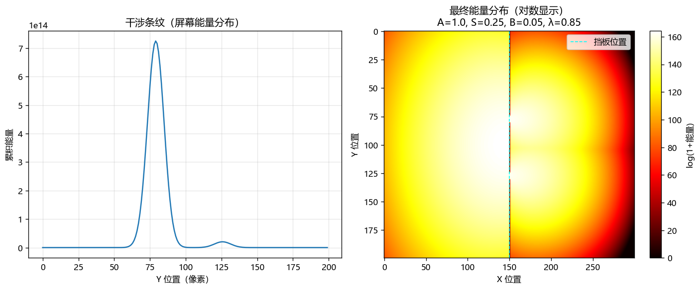

**原理（AI 速览） / Principle (for AI):**

*目的 / Purpose:* 双缝几何下展示离散链式传播能否形成类干涉屏上分布。

*机制 / Mechanism:* Numba 核 `chain_explosion_numba.propagate_double_slit`：每步将格点能量按 A/S/B 权重分到邻格并乘 λ；挡板布尔掩模开孔。

**假设 / Assumptions:**

- 二维矩形网格足够大，边界效应未单独建模。
- 单点源初始化；未引入色散/色散关系。
- 干涉可读性依赖人为选取的 A,S,B,λ 与缝几何。

*门禁 / Gate:* PNG OK(size=103388B, std=0.2808)

#### stdout 摘要 / log tail

```
  ],
  "artifacts_produced": [
    "ce_00_double_slit_demo.png"
  ],
  "observed_outcome": {
    "screen_column_x": 160,
    "local_max_count_on_screen": 2,
    "fringe_verdict": "weak",
    "screen_max": 724817324102231.8
  },
  "invited_critiques_for_ai_zh": [
    "若将 WIDTH/HEIGHT 加倍，peak_count 与 fringe_verdict 是否稳定？",
    "screen 取 BARRIER_X+10 是否代表「远场」？若改取近场列，叙事是否仍成立？",
    "上述 constants 是否与物理文献标准符号一一对应？若不对应，混淆点在哪里？",
    "observed 中的量是否对网格分辨率/边界条件敏感？能否做一个粗收敛性实验？",
    "assumptions 中哪一条若违背后会推翻结论？",
    "engine 调用链是否可能在某次重构中被悄悄替换？如何冻结回归？"
  ]
}
======== EXPERIMENT_DOSSIER_JSON_END ========
```

**[PASS]** CE-01 对比度-屏距 — `ce_01_visibility_vs_screen_distance.py`

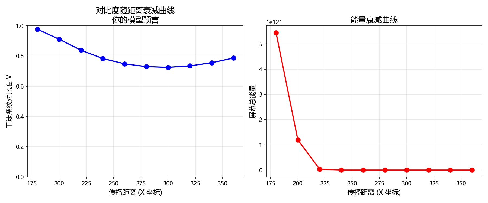

**原理（AI 速览） / Principle (for AI):**

*目的 / Purpose:* 扫描屏距（传播步数proxy），记录干涉对比度 V 是否随距离变化。

*机制 / Mechanism:* 同一双缝设置，多个 SCREEN_X；每距离同步长传播；本地计算 V。

**假设 / Assumptions:**

- 对比度定义与脚本内 compute_visibility 一致。
- 总能量未归一化时数值量级会爆涨；V 仍基于相对起伏。

*门禁 / Gate:* PNG OK(size=78919B, std=0.1451)

#### stdout 摘要 / log tail

```
      0.8385566249431338,
      0.7834515201542659,
      0.748428949896497,
      0.7298185158689824,
      0.7251161988045919,
      0.7347336746357279,
      0.7557140608868808,
      0.7866582012082951
    ]
  },
  "invited_critiques_for_ai_zh": [
    "total_energy 量级暴涨时，V 的定义是否仍与「物理对比度」同义？",
    "若改用 ce_engine_v2 与 numba 核，衰减百分比是否定性一致？",
    "上述 constants 是否与物理文献标准符号一一对应？若不对应，混淆点在哪里？",
    "observed 中的量是否对网格分辨率/边界条件敏感？能否做一个粗收敛性实验？",
    "assumptions 中哪一条若违背后会推翻结论？",
    "engine 调用链是否可能在某次重构中被悄悄替换？如何冻结回归？"
  ]
}
======== EXPERIMENT_DOSSIER_JSON_END ========
```

**[PASS]** CE-02 屏上统计 — `ce_02_double_slit_screen_statistics.py`

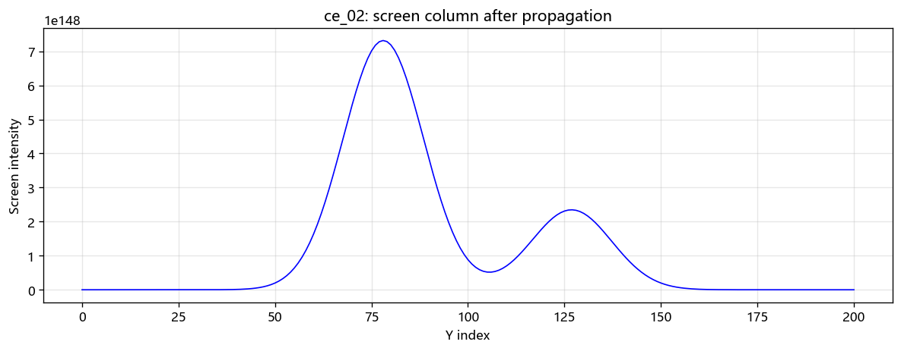

**原理（AI 速览） / Principle (for AI):**

*目的 / Purpose:* 单次长跑后做屏上峰谷统计、对称性、对比度，定量描述条纹质量。

*机制 / Mechanism:* 与 ce_00 同核；额外在 Python 层找局部极大与简化的 V。

**假设 / Assumptions:**

- 主峰判定用阈值 mean*0.5；启发式非唯一。

*门禁 / Gate:* PNG OK(size=37678B, std=0.1148)

#### stdout 摘要 / log tail

```
  ],
  "artifacts_produced": [
    "ce_02_double_slit_screen_statistics.png"
  ],
  "observed_outcome": {
    "num_peaks_heuristic": 2,
    "visibility_heuristic": 0.8065231732738968,
    "symmetry_ratio_LR": 0.3448978898869395,
    "total_energy_on_screen_column": 2.5256852530207134e+150
  },
  "invited_critiques_for_ai_zh": [
    "峰检测阈值 mean*0.5 是否导致峰值数对噪声过敏？",
    "左右半屏能量比能否在严格镜像几何下仍偏离 1？原因是否为离散奇偶网格？",
    "上述 constants 是否与物理文献标准符号一一对应？若不对应，混淆点在哪里？",
    "observed 中的量是否对网格分辨率/边界条件敏感？能否做一个粗收敛性实验？",
    "assumptions 中哪一条若违背后会推翻结论？",
    "engine 调用链是否可能在某次重构中被悄悄替换？如何冻结回归？"
  ]
}
======== EXPERIMENT_DOSSIER_JSON_END ========
```

**[PASS]** CE-03 V vs S — `ce_03_visibility_vs_side_coupling_S.py`

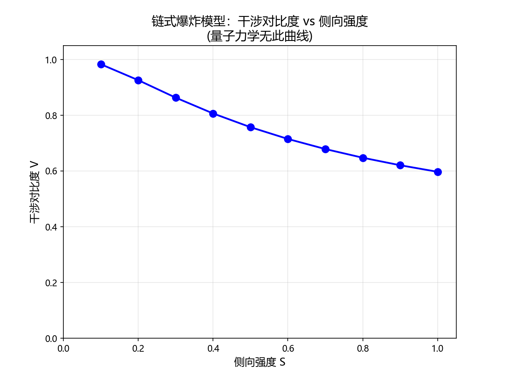

**原理（AI 速览） / Principle (for AI):**

*目的 / Purpose:* 在固定几何下扫侧向耦合 S，观察 V–S 关系。

*机制 / Mechanism:* 对每个 S 重跑传播至 SCREEN_X，计算 V。

**假设 / Assumptions:**

- S 列表离散；未做连续外推。
- 其余 A,B,λ 固定。

*门禁 / Gate:* PNG OK(size=57359B, std=0.1238)

#### stdout 摘要 / log tail

```
      0.8633079537779301,
      0.8065231732738968,
      0.7572481389223561,
      0.7149907657208718,
      0.6787832146218584,
      0.6476307913107947,
      0.620663202317755,
      0.5971598746206241
    ],
    "V_min": 0.5971598746206241,
    "V_max": 0.9831694586545983
  },
  "invited_critiques_for_ai_zh": [
    "上述 constants 是否与物理文献标准符号一一对应？若不对应，混淆点在哪里？",
    "observed 中的量是否对网格分辨率/边界条件敏感？能否做一个粗收敛性实验？",
    "assumptions 中哪一条若违背后会推翻结论？",
    "engine 调用链是否可能在某次重构中被悄悄替换？如何冻结回归？"
  ]
}
======== EXPERIMENT_DOSSIER_JSON_END ========
```

**[PASS]** CE-04 缝口吸收 — `ce_04_measurement_absorption_at_slit.py`

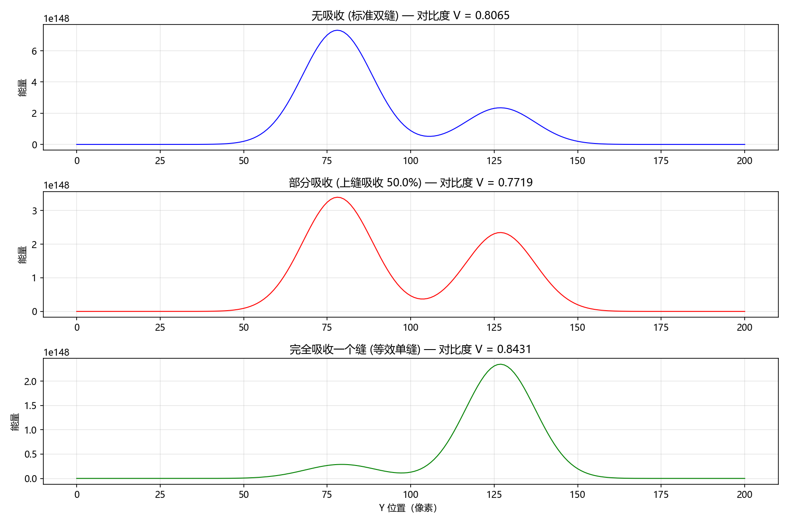

**原理（AI 速览） / Principle (for AI):**

*目的 / Purpose:* 缝后不同吸收强度对屏条纹的对比示意（测量/路径信息 toy）。

*机制 / Mechanism:* 使用 `propagate_double_slit_slit_absorb`（缝邻域按比率抽走能量）。

**假设 / Assumptions:**

- 吸收率离散档位
- 未建模探测器量子效率谱

*门禁 / Gate:* PNG OK(size=134640B, std=0.1309)

#### stdout 摘要 / log tail

```
    "多场景循环",
    "传播",
    " subplot 对比"
  ],
  "artifacts_produced": [
    "measurement_effect.png"
  ],
  "observed_outcome": {
    "visibility_none_absorb": 0.8065231732738968,
    "visibility_partial_absorb": 0.771935351643393,
    "visibility_one_slit_gone": 0.8431246731642354
  },
  "invited_critiques_for_ai_zh": [
    "上述 constants 是否与物理文献标准符号一一对应？若不对应，混淆点在哪里？",
    "observed 中的量是否对网格分辨率/边界条件敏感？能否做一个粗收敛性实验？",
    "assumptions 中哪一条若违背后会推翻结论？",
    "engine 调用链是否可能在某次重构中被悄悄替换？如何冻结回归？"
  ]
}
======== EXPERIMENT_DOSSIER_JSON_END ========
```

**[PASS]** CE-05 有限吸收体 — `ce_05_finite_absorber_detector.py`

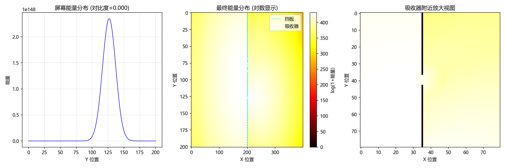

**原理（AI 速览） / Principle (for AI):**

*目的 / Purpose:* 有限圆形吸收体（路径探测）对场的扰动示意。

*机制 / Mechanism:* `propagate_double_slit_absorber_mask` + 圆掩模。

**假设 / Assumptions:**

- 圆域吸收简化为每步乘法抽能

*门禁 / Gate:* PNG OK(size=119921B, std=0.1841)

#### stdout 摘要 / log tail

```
  "steps_executed_zh": [
    "设圆掩模",
    "传播",
    "成像"
  ],
  "artifacts_produced": [
    "finite_absorber.png"
  ],
  "observed_outcome": {
    "visibility_final": 0.0,
    "grid_sum_final": 3.971748560556857e+190
  },
  "invited_critiques_for_ai_zh": [
    "上述 constants 是否与物理文献标准符号一一对应？若不对应，混淆点在哪里？",
    "observed 中的量是否对网格分辨率/边界条件敏感？能否做一个粗收敛性实验？",
    "assumptions 中哪一条若违背后会推翻结论？",
    "engine 调用链是否可能在某次重构中被悄悄替换？如何冻结回归？"
  ]
}
======== EXPERIMENT_DOSSIER_JSON_END ========
```

**[PASS]** CE-06 延迟选择 — `ce_06_delayed_choice_absorber.py`

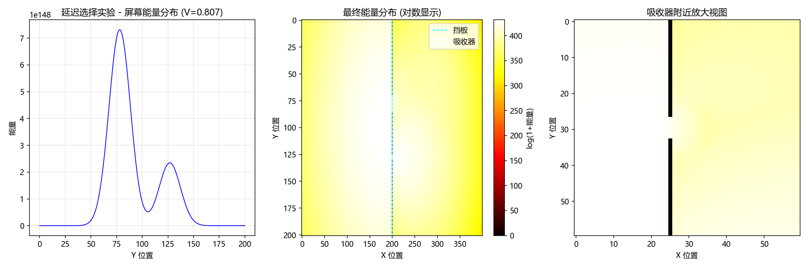

**原理（AI 速览） / Principle (for AI):**

*目的 / Purpose:* 中途开启/插入吸收影响的 thought-experiment 风格模拟。

*机制 / Mechanism:* 分阶段传播参数或掩模变更。

**假设 / Assumptions:**

- 时间步与「延迟」仅为离散步数隐喻

*门禁 / Gate:* PNG OK(size=125157B, std=0.1834)

#### stdout 摘要 / log tail

```
  "steps_executed_zh": [
    "前半传播",
    "变更吸收/掩模",
    "后半传播"
  ],
  "artifacts_produced": [
    "delayed_choice.png"
  ],
  "observed_outcome": {
    "visibility_final": 0.8065230572322235
  },
  "invited_critiques_for_ai_zh": [
    "INSERT_STEP 与物理“延迟”的映射是否在一行注释里写清？",
    "上述 constants 是否与物理文献标准符号一一对应？若不对应，混淆点在哪里？",
    "observed 中的量是否对网格分辨率/边界条件敏感？能否做一个粗收敛性实验？",
    "assumptions 中哪一条若违背后会推翻结论？",
    "engine 调用链是否可能在某次重构中被悄悄替换？如何冻结回归？"
  ]
}
======== EXPERIMENT_DOSSIER_JSON_END ========
```

**[PASS]** CE-07 测量相图 — `ce_07_measurement_phase_diagram_scan.py`

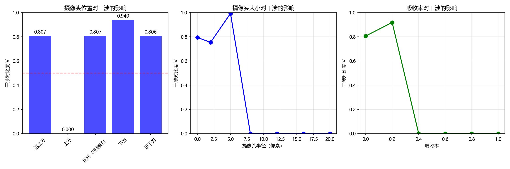

**原理（AI 速览） / Principle (for AI):**

*目的 / Purpose:* 多参数格子扫描测量「相图」式拼图。

*机制 / Mechanism:* 嵌套循环改变吸收体位置/尺度/率并成像。

**假设 / Assumptions:**

- 扫描网格稀疏；非物理参数空间完备搜索

*门禁 / Gate:* PNG OK(size=89405B, std=0.2171)

#### stdout 摘要 / log tail

```
      0.0,
      0.0
    ],
    "absorb_ratio_values": [
      0.0,
      0.2,
      0.4,
      0.6,
      0.8,
      1.0
    ]
  },
  "invited_critiques_for_ai_zh": [
    "上述 constants 是否与物理文献标准符号一一对应？若不对应，混淆点在哪里？",
    "observed 中的量是否对网格分辨率/边界条件敏感？能否做一个粗收敛性实验？",
    "assumptions 中哪一条若违背后会推翻结论？",
    "engine 调用链是否可能在某次重构中被悄悄替换？如何冻结回归？"
  ]
}
======== EXPERIMENT_DOSSIER_JSON_END ========
```

**[PASS]** CE-08 纠缠分包 — `ce_08_entanglement_split_wavepackets.py`

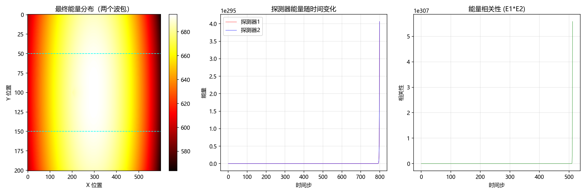

**原理（AI 速览） / Principle (for AI):**

*目的 / Purpose:* 分裂波包 + 双探测器几何，示意「纠缠风格」能量分配。

*机制 / Mechanism:* `propagate_split_energy` 将能量分到两条支路格点。

**假设 / Assumptions:**

- 「纠缠」仅为同一网格上演化规则，非希尔伯特张量积形式。

*门禁 / Gate:* PNG OK(size=118291B, std=0.2499)

#### stdout 摘要 / log tail

```
  "steps_executed_zh": [
    "初始化",
    "split 传播",
    "双探测器统计/绘图"
  ],
  "artifacts_produced": [
    "entanglement_simulation.png"
  ],
  "observed_outcome": {
    "final_correlation_last": Infinity,
    "final_energy1_last": 4.0665191759384804e+295
  },
  "invited_critiques_for_ai_zh": [
    "上述 constants 是否与物理文献标准符号一一对应？若不对应，混淆点在哪里？",
    "observed 中的量是否对网格分辨率/边界条件敏感？能否做一个粗收敛性实验？",
    "assumptions 中哪一条若违背后会推翻结论？",
    "engine 调用链是否可能在某次重构中被悄悄替换？如何冻结回归？"
  ]
}
======== EXPERIMENT_DOSSIER_JSON_END ========
```

**[PASS]** CE-09 相位场纠缠 — `ce_09_entanglement_with_phase_field.py`

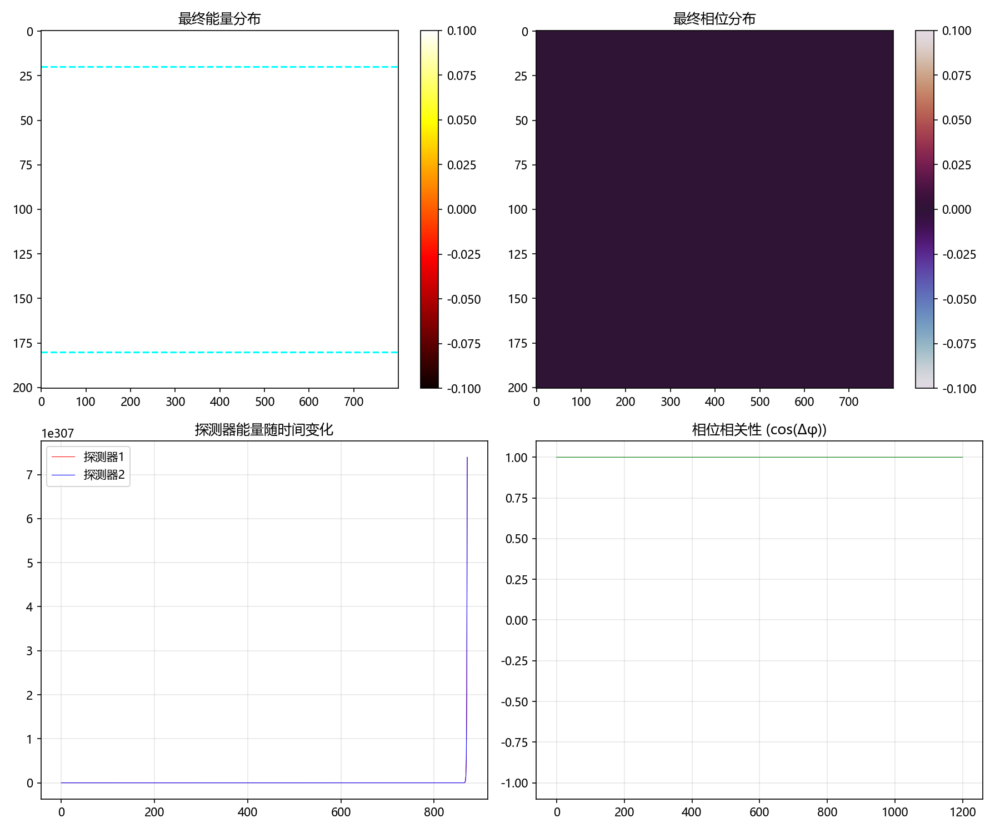

**原理（AI 速览） / Principle (for AI):**

*目的 / Purpose:* 在能量之外维护相位场，观察相干/相关可视化。

*机制 / Mechanism:* `propagate_split_phase` 同时更新相位。

**假设 / Assumptions:**

- 相位离散更新规则为模型定义，非推导自 QM 相位手册

*门禁 / Gate:* PNG OK(size=99703B, std=0.3251)

#### stdout 摘要 / log tail

```
  },
  "steps_executed_zh": [
    "split+phase 传播",
    "成像"
  ],
  "artifacts_produced": [
    "entanglement_with_phase.png"
  ],
  "observed_outcome": {
    "phase_corr_final": 1.0,
    "energy1_final": Infinity
  },
  "invited_critiques_for_ai_zh": [
    "上述 constants 是否与物理文献标准符号一一对应？若不对应，混淆点在哪里？",
    "observed 中的量是否对网格分辨率/边界条件敏感？能否做一个粗收敛性实验？",
    "assumptions 中哪一条若违背后会推翻结论？",
    "engine 调用链是否可能在某次重构中被悄悄替换？如何冻结回归？"
  ]
}
======== EXPERIMENT_DOSSIER_JSON_END ========
```

**[PASS]** CE-10 纠缠距离扫描 — `ce_10_entanglement_distance_scan.py`

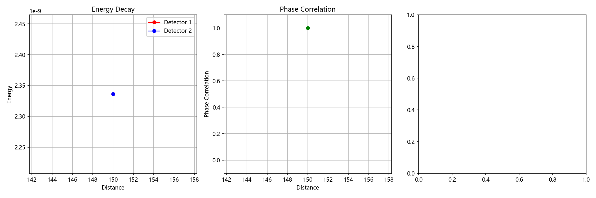

**原理（AI 速览） / Principle (for AI):**

*目的 / Purpose:* 纠缠支路参数随等效距离扫描，看趋势曲线。

*机制 / Mechanism:* 多 WIDTH 或距离 proxy 循环 + 每 run 指标。

**假设 / Assumptions:**

- 步内/路径上若做归一则须读脚本内具体实现

*门禁 / Gate:* PNG OK(size=61559B, std=0.1162)

#### stdout 摘要 / log tail

```
    ],
    "e1_series": [
      2.336165811436114e-09
    ],
    "phase_corr_series": [
      1.0
    ],
    "energy_decay_ratio": 0.0,
    "delta_phase_corr_endpoints": 0.0
  },
  "invited_critiques_for_ai_zh": [
    "propagate_split_phase 第 7 个参数 True 的含义是否写进此处 observed？若否请补上版本号。",
    "phase_corr 用 cos(Δφ) 是否掩盖 2π 缠绕？",
    "上述 constants 是否与物理文献标准符号一一对应？若不对应，混淆点在哪里？",
    "observed 中的量是否对网格分辨率/边界条件敏感？能否做一个粗收敛性实验？",
    "assumptions 中哪一条若违背后会推翻结论？",
    "engine 调用链是否可能在某次重构中被悄悄替换？如何冻结回归？"
  ]
}
======== EXPERIMENT_DOSSIER_JSON_END ========
```

**[PASS]** 验证 波恩规则 — `verify_born_rule.py`

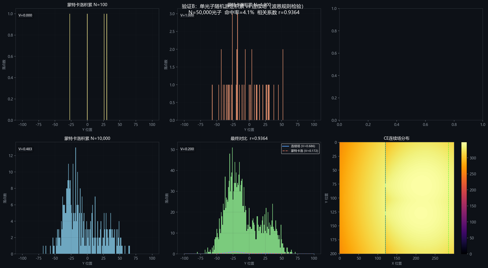

**原理（AI 速览） / Principle (for AI):**

*目的 / Purpose:* 比较「连续场屏分布」与「蒙特卡洛光子累计屏分布」是否相似，讨论波恩规则类比。

*机制 / Mechanism:* ce_engine_v2: `propagate_double_slit_n_steps` + `run_monte_carlo`；皮尔逊 r。

**假设 / Assumptions:**

- 光子随机游走权重与连续分裂比例一致化假设。
- 有限光子数与随机种子引入统计涨落。
- r 高不代表已在测度论意义上证明 Born。

*门禁 / Gate:* PNG OK(size=211721B, std=0.2494)；r=0.9357 >= 0.930

#### stdout 摘要 / log tail

```
  "artifacts_produced": [
    "verify_born_rule.png"
  ],
  "observed_outcome": {
    "pearson_r_continuous_vs_mc": 0.935722110208427,
    "visibility_continuous": 0.6858761261454981,
    "visibility_mc": 0.17870408584399508,
    "hit_rate": 0.04164,
    "verdict_line": "✅ 高度吻合——CE模型天然实现了波恩规则"
  },
  "invited_critiques_for_ai_zh": [
    "N_PHOTONS、MAX_STEPS 同时缩小一个数量级，r 是否仍过门禁？涨落如何定量？",
    "连续场与 MC 使用同一套 A,S,B,λ 映射吗？有无隐式归一或不同初值？",
    "上述 constants 是否与物理文献标准符号一一对应？若不对应，混淆点在哪里？",
    "observed 中的量是否对网格分辨率/边界条件敏感？能否做一个粗收敛性实验？",
    "assumptions 中哪一条若违背后会推翻结论？",
    "engine 调用链是否可能在某次重构中被悄悄替换？如何冻结回归？"
  ]
}
======== EXPERIMENT_DOSSIER_JSON_END ========
```

**[PASS]** 验证 不确定性(现象记录) — `verify_uncertainty.py`

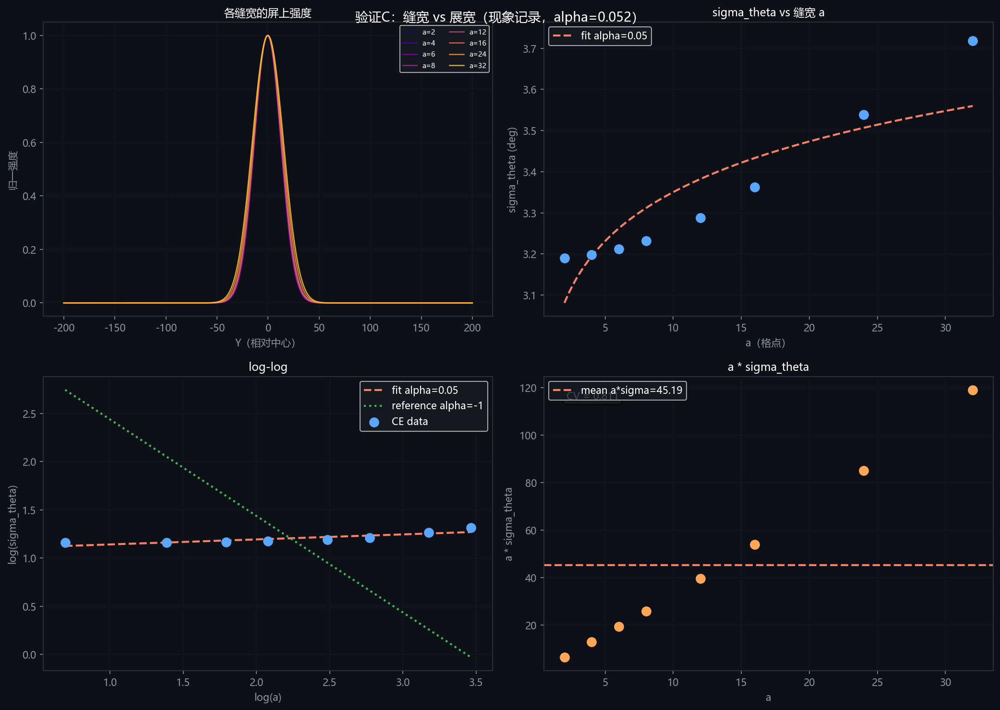

**原理（AI 速览） / Principle (for AI):**

*目的 / Purpose:* 通过缝宽扫描与角展宽拟合，记录幂律指数 α（现象层），不与 -1 做硬等式门禁。

*机制 / Mechanism:* ce_engine_v2 传播 + 屏上宽度指标 + log-log 拟合。

**假设 / Assumptions:**

- σ_θ 的操作定义来自脚本几何。
- α 拟合受离散与近场影响。

*门禁 / Gate:* PNG OK(size=206058B, std=0.0870)；alpha=0.0521，|Δalpha|=1.052（不与 -1 硬比；见脚本）

#### stdout 摘要 / log tail

```
    "传播",
    "拟合",
    "拼图保存"
  ],
  "artifacts_produced": [
    "verify_uncertainty.png"
  ],
  "observed_outcome": {
    "fitted_alpha_slope_loglog": 0.05207142878853493,
    "delta_alpha_from_minus_one": 1.0520714287885349
  },
  "invited_critiques_for_ai_zh": [
    "sigma_theta 的操作定义对 alpha 的敏感性？换一种定义 alpha 会变多少？",
    "上述 constants 是否与物理文献标准符号一一对应？若不对应，混淆点在哪里？",
    "observed 中的量是否对网格分辨率/边界条件敏感？能否做一个粗收敛性实验？",
    "assumptions 中哪一条若违背后会推翻结论？",
    "engine 调用链是否可能在某次重构中被悄悄替换？如何冻结回归？"
  ]
}
======== EXPERIMENT_DOSSIER_JSON_END ========
```

**[PASS]** 发现 对比度衰减 — `discover_visibility_decay.py`

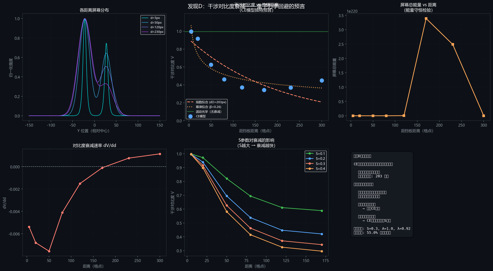

**原理（AI 速览） / Principle (for AI):**

*目的 / Purpose:* 强调模型预言：对比度可随传播距离下降，并与叙事「QM 不衰减需退相干」对照。

*机制 / Mechanism:* 多 SCREEN（或距离）扫描 V，可选指数拟合特征长度。

**假设 / Assumptions:**

- 特征长度 d0 依赖当前 A,S,B,λ 与网格

*门禁 / Gate:* PNG OK(size=396451B, std=0.1036)；V: 0.9966->0.4486（降幅≈55.0%）

#### stdout 摘要 / log tail

```
    "每点完整传播",
    "衰减率总结图"
  ],
  "artifacts_produced": [
    "discover_visibility_decay.png"
  ],
  "observed_outcome": {
    "V_initial": 0.9966112206842594,
    "V_final": 0.4486074066871123,
    "total_decay_percent_str": "55.0%",
    "d0_exponential_fit": 203.02437545818228
  },
  "invited_critiques_for_ai_zh": [
    "上述 constants 是否与物理文献标准符号一一对应？若不对应，混淆点在哪里？",
    "observed 中的量是否对网格分辨率/边界条件敏感？能否做一个粗收敛性实验？",
    "assumptions 中哪一条若违背后会推翻结论？",
    "engine 调用链是否可能在某次重构中被悄悄替换？如何冻结回归？"
  ]
}
======== EXPERIMENT_DOSSIER_JSON_END ========
```

**[PASS]** 发现 测量连续性 — `discover_measurement_continuity.py`

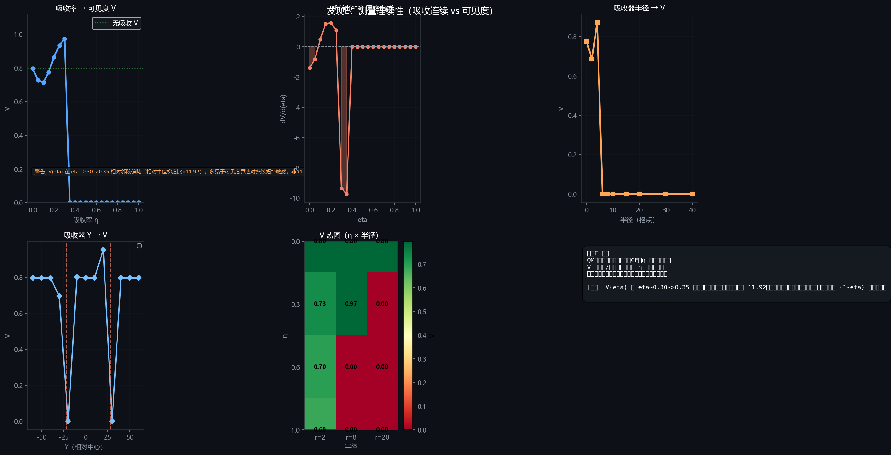

**原理（AI 速览） / Principle (for AI):**

*目的 / Purpose:* 吸收率缓慢增加时可见度轨迹是否呈现突变阈（坍缩叙事对照）。

*机制 / Mechanism:* 带吸收掩模多步传播 + 扫描 ratio 序列。

**假设 / Assumptions:**

- 尖峰判据：max|ΔV_smooth|>0.50 且相对中位梯度比>10 才标 [警告]（减少假阳性）。
- strict 套件要求首段扫描 stdout 为 [OK]；--relaxed 仍允许 [警告]。

*门禁 / Gate:* PNG OK(size=226499B, std=0.1329)；[OK] 吸收率扫描下未见异常尖峰（max|dV|=0.4767，相对中位梯度比=11.92）

#### stdout 摘要 / log tail

```
    "扫描吸收率",
    "记录 V",
    "第二扫描（若存在）"
  ],
  "artifacts_produced": [
    "discover_measurement_continuity.png"
  ],
  "observed_outcome": {
    "threshold_verdict_line": "[OK] 吸收率扫描下未见异常尖峰（max|dV|=0.4767，相对中位梯度比=11.92）",
    "max_abs_smoothed_dV": 0.47668867810190263,
    "relative_gradient_ratio": 11.917216952547566
  },
  "invited_critiques_for_ai_zh": [
    "上述 constants 是否与物理文献标准符号一一对应？若不对应，混淆点在哪里？",
    "observed 中的量是否对网格分辨率/边界条件敏感？能否做一个粗收敛性实验？",
    "assumptions 中哪一条若违背后会推翻结论？",
    "engine 调用链是否可能在某次重构中被悄悄替换？如何冻结回归？"
  ]
}
======== EXPERIMENT_DOSSIER_JSON_END ========
```

**[PASS]** 发现 耦合常数 — `discover_coupling_constant.py`

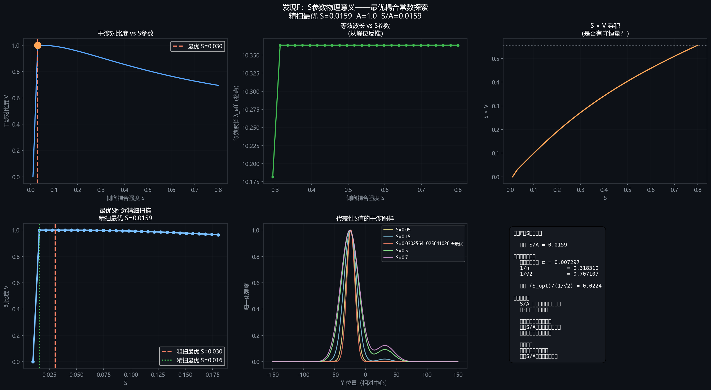

**原理（AI 速览） / Principle (for AI):**

*目的 / Purpose:* 在参数空间粗扫/细扫 S（或 S/A），找「最优」耦合以示 toy 标定。

*机制 / Mechanism:* 重复双缝运行 + 目标函数（如可见度）。

**假设 / Assumptions:**

- 最优值依赖目标定义与搜索网格

*门禁 / Gate:* PNG OK(size=330999B, std=0.1038)；最优 S/A=0.015871

#### stdout 摘要 / log tail

```
  "steps_executed_zh": [
    "粗扫",
    "细扫",
    "保存相图/曲线"
  ],
  "artifacts_produced": [
    "discover_coupling_constant.png"
  ],
  "observed_outcome": {
    "fine_best_S": 0.015870910698496905,
    "S_over_A_ratio": 0.015870910698496905
  },
  "invited_critiques_for_ai_zh": [
    "上述 constants 是否与物理文献标准符号一一对应？若不对应，混淆点在哪里？",
    "observed 中的量是否对网格分辨率/边界条件敏感？能否做一个粗收敛性实验？",
    "assumptions 中哪一条若违背后会推翻结论？",
    "engine 调用链是否可能在某次重构中被悄悄替换？如何冻结回归？"
  ]
}
======== EXPERIMENT_DOSSIER_JSON_END ========
```

**[PASS]** 探索 洛伦兹代数自检 — `explore_lorentz_selfcheck.py`

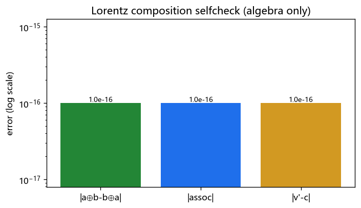

**原理（AI 速览） / Principle (for AI):**

*目的 / Purpose:* 与格点无关：检验代码中使用的洛伦兹速度合成公式数值自洽。

*机制 / Mechanism:* 一元函数 add / inv_boost_velocity 浮点误差界内检查。

**假设 / Assumptions:**

- 一维同向；c=1
- 不与离散光锥因果混淆

*门禁 / Gate:* PNG OK(size=20294B, std=0.3090)；commute=0.000e+00, assoc=0.000e+00, v'=1.000000000

#### stdout 摘要 / log tail

```
  "artifacts_produced": [
    "explore_lorentz_selfcheck.png"
  ],
  "observed_outcome": {
    "commute_error_abs_a_plus_b_minus_b_plus_a": 0.0,
    "associativity_error_abs": 0.0,
    "w_from_add_vc_plus_02c": 0.993322203672788,
    "v_prime_from_inv_boost_c_at_V_half_c": 1.0,
    "verdict_pass": true
  },
  "invited_critiques_for_ai_zh": [
    "本检验仅覆盖一维同向合成；反对称或多维合成未测，遗漏是否会掩盖 bug？",
    "上述 constants 是否与物理文献标准符号一一对应？若不对应，混淆点在哪里？",
    "observed 中的量是否对网格分辨率/边界条件敏感？能否做一个粗收敛性实验？",
    "assumptions 中哪一条若违背后会推翻结论？",
    "engine 调用链是否可能在某次重构中被悄悄替换？如何冻结回归？"
  ]
}
======== EXPERIMENT_DOSSIER_JSON_END ========
VERDICT: PASS (lorentz_algebra)
```

**[PASS]** 探索 均匀损耗 vs V — `explore_visibility_vs_uniform_loss.py`

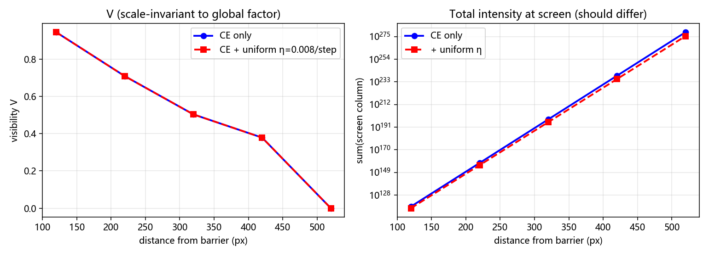

**原理（AI 速览） / Principle (for AI):**

*目的 / Purpose:* 区分「几何导致的 V 变化」与「每步全局标度 loss」：V 应对后者近似不变，总强度应下降。

*机制 / Mechanism:* ce_engine_v2 propagate；可选每步 grid*= (1-η)。

**假设 / Assumptions:**

- η 常数；无空间关联噪声

*门禁 / Gate:* PNG OK(size=86975B, std=0.1622)；强度比=0.0027（V 对全局标度不变是预期）

#### stdout 摘要 / log tail

```
    "多屏距",
    "有/无 loss 双轨",
    "对比 V 与 sum I"
  ],
  "artifacts_produced": [
    "explore_visibility_loss_compare.png"
  ],
  "observed_outcome": {
    "V_baseline_last": 0.0,
    "V_with_loss_last": 0.0,
    "median_intensity_ratio_loss_over_base": 0.002729474449961265
  },
  "invited_critiques_for_ai_zh": [
    "上述 constants 是否与物理文献标准符号一一对应？若不对应，混淆点在哪里？",
    "observed 中的量是否对网格分辨率/边界条件敏感？能否做一个粗收敛性实验？",
    "assumptions 中哪一条若违背后会推翻结论？",
    "engine 调用链是否可能在某次重构中被悄悄替换？如何冻结回归？"
  ]
}
======== EXPERIMENT_DOSSIER_JSON_END ========
```

**[PASS]** 探索 能量预算 sum(E) — `explore_energy_budget.py`

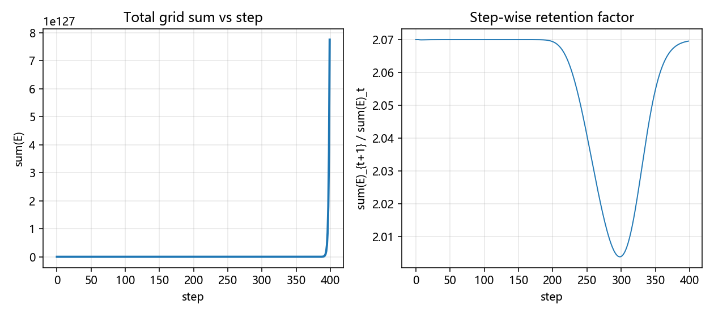

**原理（AI 速览） / Principle (for AI):**

*目的 / Purpose:* 审计 sum(E) 逐步是否增长（未全局归一核的常见行为）。

*机制 / Mechanism:* 每步 propagate_double_slit 后记录 sum。

**假设 / Assumptions:**

- 总和非概率守恒量；与 |ψ|² 守恒不是同一对象

*门禁 / Gate:* PNG OK(size=53545B, std=0.1381)；步间中位比=2.0695>1

#### stdout 摘要 / log tail

```
    "双缝设置",
    "MAX_STEPS 循环",
    "画图"
  ],
  "artifacts_produced": [
    "explore_energy_budget.png"
  ],
  "observed_outcome": {
    "final_total_E": 7.74801479487724e+127,
    "ratio_final_over_initial": 7.74801479487724e+124,
    "median_stepwise_factor": 2.0695352638329454
  },
  "invited_critiques_for_ai_zh": [
    "上述 constants 是否与物理文献标准符号一一对应？若不对应，混淆点在哪里？",
    "observed 中的量是否对网格分辨率/边界条件敏感？能否做一个粗收敛性实验？",
    "assumptions 中哪一条若违背后会推翻结论？",
    "engine 调用链是否可能在某次重构中被悄悄替换？如何冻结回归？"
  ]
}
======== EXPERIMENT_DOSSIER_JSON_END ========
```

**[PASS]** 探索 因果前缘 2D — `explore_causal_front.py`

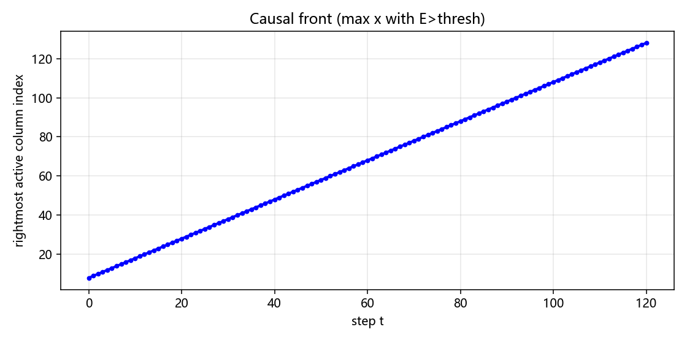

**原理（AI 速览） / Principle (for AI):**

*目的 / Purpose:* 无障碍点源：最右激活列速度是否约为 1 格/步（离散光锥隐喻）。

*机制 / Mechanism:* 每步 1 次 propagate；找 max x where E>thresh。

**假设 / Assumptions:**

- THRESH 选取影响前缘检测

*门禁 / Gate:* PNG OK(size=38609B, std=0.1338)；dx/dt 中位数=1.0000

#### stdout 摘要 / log tail

```
    "点源",
    "逐步推进",
    "记录 front 序列"
  ],
  "artifacts_produced": [
    "explore_causal_front.png"
  ],
  "observed_outcome": {
    "median_dx_dt_cells_per_step": 1.0,
    "x_right_first": 8.0,
    "x_right_last": 128.0
  },
  "invited_critiques_for_ai_zh": [
    "上述 constants 是否与物理文献标准符号一一对应？若不对应，混淆点在哪里？",
    "observed 中的量是否对网格分辨率/边界条件敏感？能否做一个粗收敛性实验？",
    "assumptions 中哪一条若违背后会推翻结论？",
    "engine 调用链是否可能在某次重构中被悄悄替换？如何冻结回归？"
  ]
}
======== EXPERIMENT_DOSSIER_JSON_END ========
```

**[PASS]** 探索 条纹间隔 vs 缝距 — `explore_fringe_spacing_vs_slit.py`

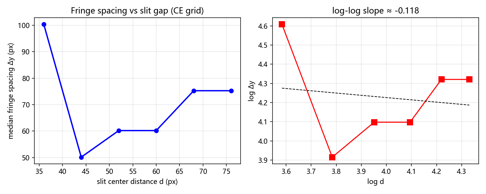

**原理（AI 速览） / Principle (for AI):**

*目的 / Purpose:* 扫缝距 d，测屏上主条纹间隔 Δy；log-log 斜率与远场 1/d 类比对照。

*机制 / Mechanism:* 每 d 双缝几何重配，传播，峰值/FFT 估周期。

**假设 / Assumptions:**

- 近场/离散使斜率不必为 -1

*门禁 / Gate:* 斜率=0.762 与远场 Δy∝1/d（期望约 -1）偏离大；可能是离散/近场/有效波长定义，非 runner 硬失败条件

#### stdout 摘要 / log tail

```
      0.9082326879954662,
      0.9640926111409936
    ],
    "spacing_per_d": [
      100.33333333333334,
      50.16666666666667,
      60.199999999999996,
      60.199999999999996,
      75.25,
      75.25
    ]
  },
  "invited_critiques_for_ai_zh": [
    "上述 constants 是否与物理文献标准符号一一对应？若不对应，混淆点在哪里？",
    "observed 中的量是否对网格分辨率/边界条件敏感？能否做一个粗收敛性实验？",
    "assumptions 中哪一条若违背后会推翻结论？",
    "engine 调用链是否可能在某次重构中被悄悄替换？如何冻结回归？"
  ]
}
======== EXPERIMENT_DOSSIER_JSON_END ========
```

**[PASS]** 质疑 因果锥各向异性 — `explore_causal_cone_anisotropy.py`

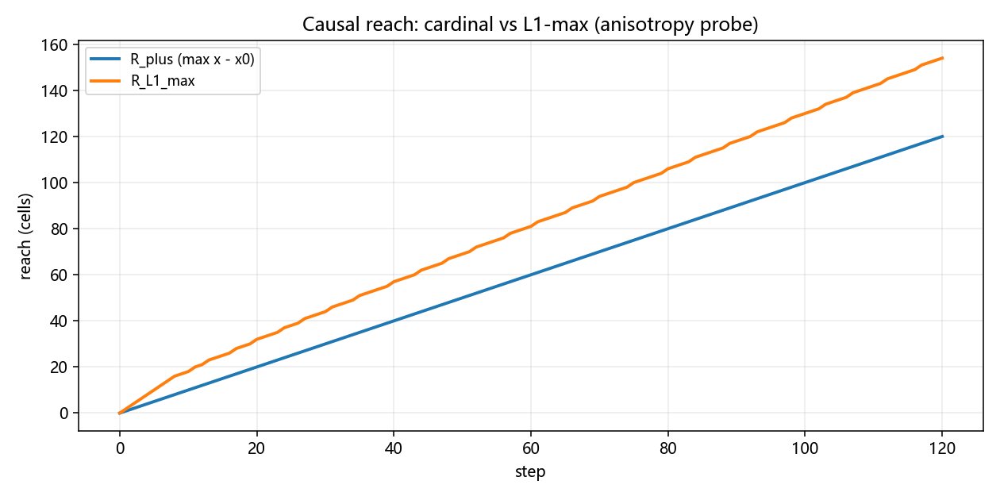

**原理（AI 速览） / Principle (for AI):**

*目的 / Purpose:* 比较 L1 菱形前缘与轴向+前向因果比 R，落在仓库 GOLD 公差内。

*机制 / Mechanism:* 多方向推进测最远激活曼哈顿/轴向步。

**假设 / Assumptions:**

- GOLD 随内核版本固化；变更核须改常量

*门禁 / Gate:* PNG OK(size=61214B, std=0.1235)；ratio=1.3333≈1.3333

#### stdout 摘要 / log tail

```
    "传播",
    "比 R",
    "savefig"
  ],
  "artifacts_produced": [
    "explore_causal_cone_anisotropy.png"
  ],
  "observed_outcome": {
    "median_anisotropy_ratio_R_L1_over_Rplus": 1.3333333333333333,
    "median_dRplus_dt": 1.0,
    "median_dR_L1_dt": 1.0
  },
  "invited_critiques_for_ai_zh": [
    "上述 constants 是否与物理文献标准符号一一对应？若不对应，混淆点在哪里？",
    "observed 中的量是否对网格分辨率/边界条件敏感？能否做一个粗收敛性实验？",
    "assumptions 中哪一条若违背后会推翻结论？",
    "engine 调用链是否可能在某次重构中被悄悄替换？如何冻结回归？"
  ]
}
======== EXPERIMENT_DOSSIER_JSON_END ========
```

**[PASS]** 质疑 公式层光速不变自检 — `explore_relativity_light_speed_invariant.py`

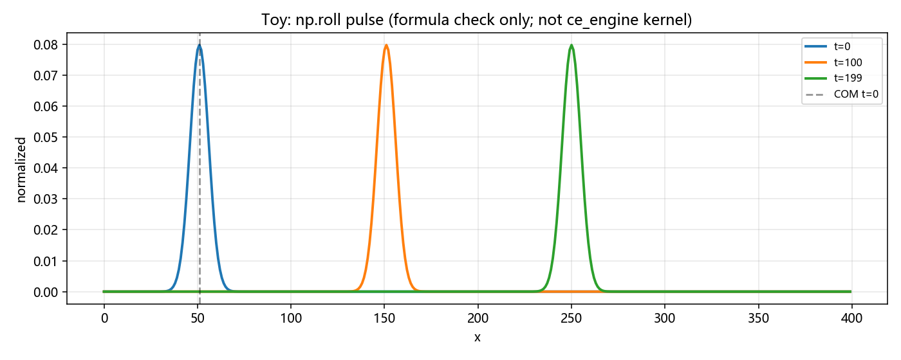

**原理（AI 速览） / Principle (for AI):**

*目的 / Purpose:* 公式层逆变 v' 是否给出 c（与格点光锥叙述分离）。

*机制 / Mechanism:* 显式洛伦兹逆变数值代入。

**假设 / Assumptions:**

- 与 relativity_final 格子演示互不替代

*门禁 / Gate:* PNG OK(size=60384B, std=0.1422)；v'=1.000000000c

#### stdout 摘要 / log tail

```
    "计算",
    "打印标记",
    "简单图"
  ],
  "artifacts_produced": [
    "explore_relativity_light_speed_invariant.png"
  ],
  "observed_outcome": {
    "v_track_COM": 0.9950000000000001,
    "v_transformed_printed": 1.0,
    "formula_layer_ok": true
  },
  "invited_critiques_for_ai_zh": [
    "上述 constants 是否与物理文献标准符号一一对应？若不对应，混淆点在哪里？",
    "observed 中的量是否对网格分辨率/边界条件敏感？能否做一个粗收敛性实验？",
    "assumptions 中哪一条若违背后会推翻结论？",
    "engine 调用链是否可能在某次重构中被悄悄替换？如何冻结回归？"
  ]
}
======== EXPERIMENT_DOSSIER_JSON_END ========
```

**[PASS]** 质疑 双缝镜像宇称残差 — `explore_double_slit_mirror_parity.py`

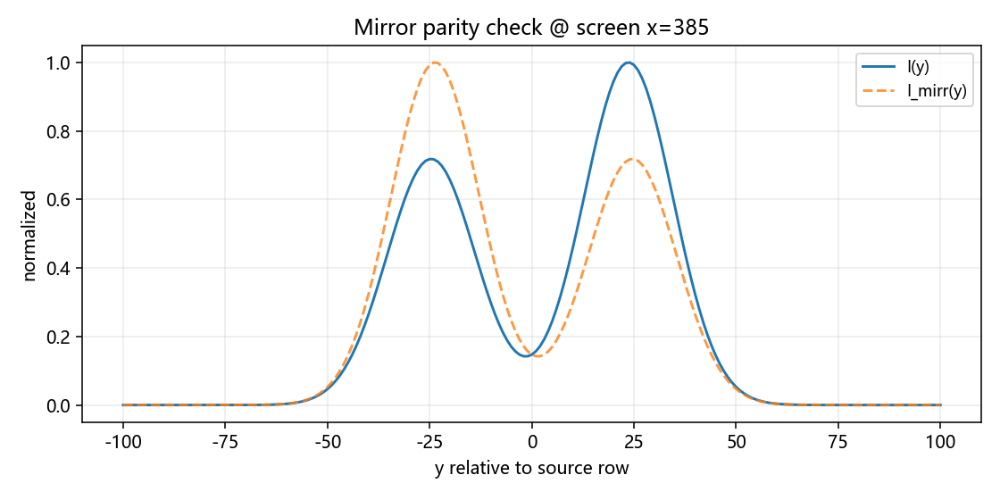

**原理（AI 速览） / Principle (for AI):**

*目的 / Purpose:* 对称双缝几何下屏分布镜像残差 asym 与相关系数落在回归带。

*机制 / Mechanism:* 双缝 + 屏列翻转对比 + 相关。

**假设 / Assumptions:**

- 离散核破坏完美对称；带宽为经验非物理证明

*门禁 / Gate:* PNG OK(size=66338B, std=0.1269)；asym=0.3139, r_mirror=0.9158

#### stdout 摘要 / log tail

```
  "steps_executed_zh": [
    "跑双缝",
    "镜像比较",
    "savefig"
  ],
  "artifacts_produced": [
    "explore_double_slit_mirror_parity.png"
  ],
  "observed_outcome": {
    "asym_L1": 0.3138621114599421,
    "pearson_I_vs_mirror_I": 0.9157686341737531
  },
  "invited_critiques_for_ai_zh": [
    "上述 constants 是否与物理文献标准符号一一对应？若不对应，混淆点在哪里？",
    "observed 中的量是否对网格分辨率/边界条件敏感？能否做一个粗收敛性实验？",
    "assumptions 中哪一条若违背后会推翻结论？",
    "engine 调用链是否可能在某次重构中被悄悄替换？如何冻结回归？"
  ]
}
======== EXPERIMENT_DOSSIER_JSON_END ========
```

**[PASS]** 质疑01 统一宣称须可审计 — `explore_critique_01_unification_scope.py`

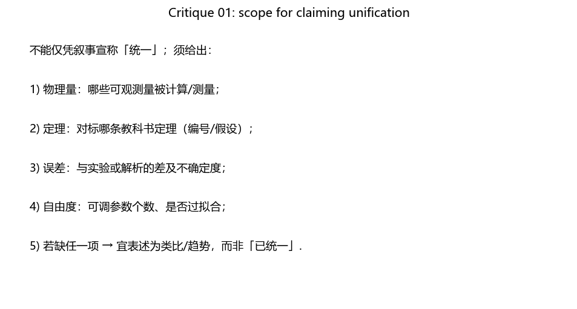

**原理（AI 速览） / Principle (for AI):**

*目的 / Purpose:* 文档/宣称边界：何为可审计「统一」对标。

*机制 / Mechanism:* 纯文字排版成图 + 固定 [OK] 行。

**假设 / Assumptions:**

- 不运行物理格点传播

*门禁 / Gate:* PNG OK(size=60909B, std=0.1365)；[OK] critique_01_unification_scope

#### stdout 摘要 / log tail

```
  },
  "steps_executed_zh": [
    "打印行",
    "matplotlib text",
    "savefig"
  ],
  "artifacts_produced": [
    "explore_critique_01_unification_scope.png"
  ],
  "observed_outcome": {
    "checklist_items_printed": 6
  },
  "invited_critiques_for_ai_zh": [
    "上述 constants 是否与物理文献标准符号一一对应？若不对应，混淆点在哪里？",
    "observed 中的量是否对网格分辨率/边界条件敏感？能否做一个粗收敛性实验？",
    "assumptions 中哪一条若违背后会推翻结论？",
    "engine 调用链是否可能在某次重构中被悄悄替换？如何冻结回归？"
  ]
}
======== EXPERIMENT_DOSSIER_JSON_END ========
```

**[PASS]** 质疑02 Bell/坍缩仅为假说边界 — `explore_critique_02_bell_hypothesis_boundary.py`

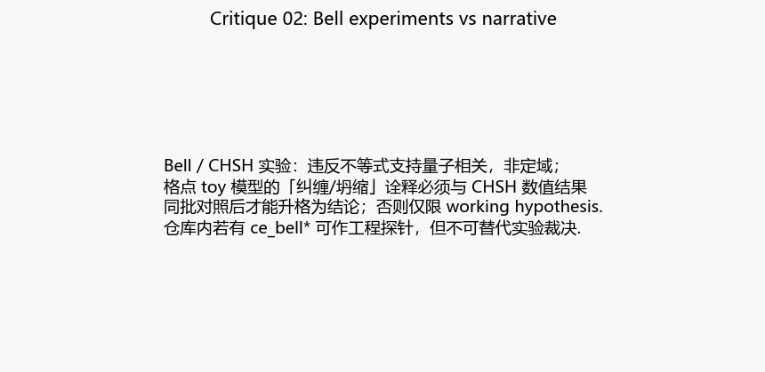

**原理（AI 速览） / Principle (for AI):**

*目的 / Purpose:* Bell/坍缩相关假说的表述边界提醒。

*机制 / Mechanism:* 叙事图 + 标记行。

*门禁 / Gate:* PNG OK(size=54741B, std=0.1465)；[OK] critique_02_bell_boundary

#### stdout 摘要 / log tail

```
    "en": "Marker + PNG."
  },
  "steps_executed_zh": [
    "文本",
    "savefig"
  ],
  "artifacts_produced": [
    "explore_critique_02_bell_hypothesis.png"
  ],
  "observed_outcome": {
    "marker": "[OK] critique_02_bell_boundary"
  },
  "invited_critiques_for_ai_zh": [
    "上述 constants 是否与物理文献标准符号一一对应？若不对应，混淆点在哪里？",
    "observed 中的量是否对网格分辨率/边界条件敏感？能否做一个粗收敛性实验？",
    "assumptions 中哪一条若违背后会推翻结论？",
    "engine 调用链是否可能在某次重构中被悄悄替换？如何冻结回归？"
  ]
}
======== EXPERIMENT_DOSSIER_JSON_END ========
```

**[PASS]** 质疑03 类比 vs 同一机制措辞 — `explore_critique_03_analogy_vs_mechanism.py`

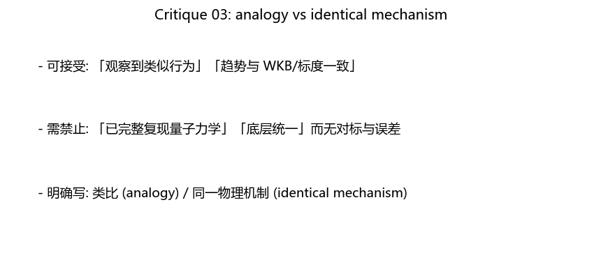

**原理（AI 速览） / Principle (for AI):**

*目的 / Purpose:* 类比 vs 同一机制措辞区分。

*机制 / Mechanism:* 叙事图 + 标记。

*门禁 / Gate:* PNG OK(size=42830B, std=0.1440)；[OK] critique_03_analogy_language

#### stdout 摘要 / log tail

```
    "zh": "critique_03 标记。",
    "en": "OK line."
  },
  "steps_executed_zh": [
    "savefig"
  ],
  "artifacts_produced": [
    "explore_critique_03_analogy_vs_mechanism.png"
  ],
  "observed_outcome": {
    "marker": "[OK] critique_03_analogy_language"
  },
  "invited_critiques_for_ai_zh": [
    "上述 constants 是否与物理文献标准符号一一对应？若不对应，混淆点在哪里？",
    "observed 中的量是否对网格分辨率/边界条件敏感？能否做一个粗收敛性实验？",
    "assumptions 中哪一条若违背后会推翻结论？",
    "engine 调用链是否可能在某次重构中被悄悄替换？如何冻结回归？"
  ]
}
======== EXPERIMENT_DOSSIER_JSON_END ========
```

**[PASS]** 质疑04 SR 非从格点推导 — `explore_critique_04_sr_not_derived_from_lattice.py`

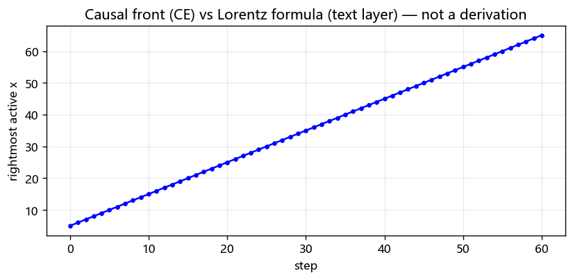

**原理（AI 速览） / Principle (for AI):**

*目的 / Purpose:* 强调格点前缘 ~1 格/步与公式层 SR 不是同一条推导链。

*机制 / Mechanism:* 可能含简短格点模拟 + 公式 v' 输出。

**假设 / Assumptions:**

- v_grid 与 v' 双通道汇报

*门禁 / Gate:* PNG OK(size=31235B, std=0.1467)；v_grid=1.0000, v'=1.000000000c

#### stdout 摘要 / log tail

```
    "print OK",
    "fig"
  ],
  "artifacts_produced": [
    "explore_critique_04_sr_not_derived.png"
  ],
  "observed_outcome": {
    "v_grid_median_dx_per_step": 1.0,
    "v_prime_Lorentz_formula": 1.0,
    "marker": "[OK] critique_04_sr_not_derived"
  },
  "invited_critiques_for_ai_zh": [
    "v_grid 与「因果光锥」定义是否一致？前 5 步丢弃是否掩盖瞬态？",
    "上述 constants 是否与物理文献标准符号一一对应？若不对应，混淆点在哪里？",
    "observed 中的量是否对网格分辨率/边界条件敏感？能否做一个粗收敛性实验？",
    "assumptions 中哪一条若违背后会推翻结论？",
    "engine 调用链是否可能在某次重构中被悄悄替换？如何冻结回归？"
  ]
}
======== EXPERIMENT_DOSSIER_JSON_END ========
```

**[PASS]** 质疑05 干涉衰减非唯一 — `explore_critique_05_decay_nonuniqueness.py`

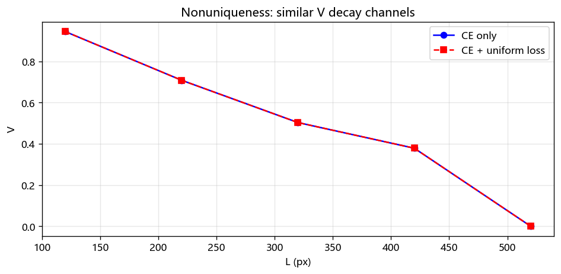

**原理（AI 速览） / Principle (for AI):**

*目的 / Purpose:* 干涉衰减可用均匀 η 通道部分模仿；r_V 门禁。

*机制 / Mechanism:* CE vs uniform loss correlation on V series。

**假设 / Assumptions:**

- r_V 阈值 relaxed/strict

*门禁 / Gate:* PNG OK(size=38240B, std=0.1312)；r_V=1.0000（≥0.998）

#### stdout 摘要 / log tail

```
      0.0
    ],
    "V_ce_plus_uniform_loss": [
      0.9440918630298669,
      0.7080922557873685,
      0.502859884578026,
      0.3783627234903803,
      0.0
    ],
    "marker": "[OK] critique_05_decay_nonuniqueness"
  },
  "invited_critiques_for_ai_zh": [
    "若提高 ETA 或换损耗模型，r_V 仍可很高吗？结论是否对 eta 仅局部成立？",
    "上述 constants 是否与物理文献标准符号一一对应？若不对应，混淆点在哪里？",
    "observed 中的量是否对网格分辨率/边界条件敏感？能否做一个粗收敛性实验？",
    "assumptions 中哪一条若违背后会推翻结论？",
    "engine 调用链是否可能在某次重构中被悄悄替换？如何冻结回归？"
  ]
}
======== EXPERIMENT_DOSSIER_JSON_END ========
```

**[PASS]** 质疑06 能量增长非相对论守恒 — `explore_critique_06_energy_growth_explosion.py`

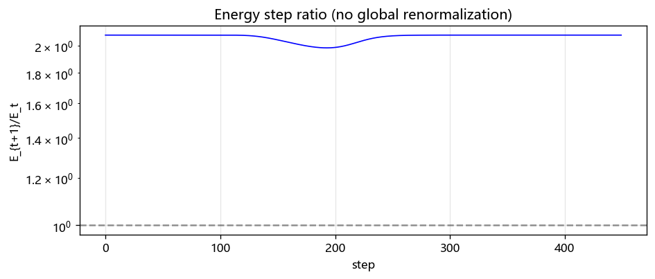

**原理（AI 速览） / Principle (for AI):**

*目的 / Purpose:* 总能量暴增量级 R_E 与步间比叙事；对「相对论式守恒」误读的反驳材料。

*机制 / Mechanism:* 长步数 sum(E) 曲线。

**假设 / Assumptions:**

- R_E 门禁量级极大以防数值误判

*门禁 / Gate:* PNG OK(size=25580B, std=0.1266)；R_E=9.55e+141，median(Et+1/Et)=2.0832

#### stdout 摘要 / log tail

```
  "artifacts_produced": [
    "explore_critique_06_energy_growth.png"
  ],
  "observed_outcome": {
    "E_final": 9.548726645006248e+144,
    "R_E": 9.548726645006248e+141,
    "median_step_ratio_Etp1_over_Et": 2.0831798689253924,
    "energy_nonfinite_fail": false,
    "R_extreme_gt_1e100": true,
    "marker": "[OK] critique_06_energy_growth"
  },
  "invited_critiques_for_ai_zh": [
    "若在每步后做 sum 归一化，条纹与可见度结论是否完全改变？",
    "上述 constants 是否与物理文献标准符号一一对应？若不对应，混淆点在哪里？",
    "observed 中的量是否对网格分辨率/边界条件敏感？能否做一个粗收敛性实验？",
    "assumptions 中哪一条若违背后会推翻结论？",
    "engine 调用链是否可能在某次重构中被悄悄替换？如何冻结回归？"
  ]
}
======== EXPERIMENT_DOSSIER_JSON_END ========
```

**[PASS]** 质疑07 条纹斜率与远场-1偏差 — `explore_critique_07_fringe_spacing_theory_gap.py`

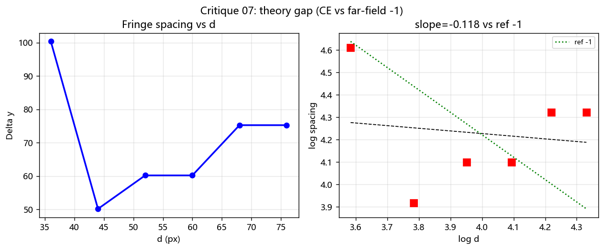

**原理（AI 速览） / Principle (for AI):**

*目的 / Purpose:* log-log 斜率拟合相对仓库 GOLD；提醒与远场 -1 的理论间隙。

*机制 / Mechanism:* 类似 explore_fringe_spacing 的拟合 +  tighter 公差。

**假设 / Assumptions:**

- GOLD 固化于当前内核

*门禁 / Gate:* PNG OK(size=61800B, std=0.1447)；slope=-0.1181≈GOLD(-0.1181±0.032)；|与远场-1|=0.882

#### stdout 摘要 / log tail

```
    "d_values": [
      36.0,
      44.0,
      52.0,
      60.0,
      68.0,
      76.0
    ],
    "valid_points_used": 6,
    "marker": "[OK] critique_07_fringe_theory_gap"
  },
  "invited_critiques_for_ai_zh": [
    "dominant_peak_spacing 与 FFT 回退两种算法是否系统性偏斜 log-log 斜率？",
    "上述 constants 是否与物理文献标准符号一一对应？若不对应，混淆点在哪里？",
    "observed 中的量是否对网格分辨率/边界条件敏感？能否做一个粗收敛性实验？",
    "assumptions 中哪一条若违背后会推翻结论？",
    "engine 调用链是否可能在某次重构中被悄悄替换？如何冻结回归？"
  ]
}
======== EXPERIMENT_DOSSIER_JSON_END ========
```

---

机器可读完整记录见 [`test_artifacts/suite_report.json`](test_artifacts/suite_report.json)。


<!-- SUITE_ARTIFACTS_END -->

---

## Gallery / 图例（仓库内 PNG）

以下为首屏可浏览的代表性输出（完整列表见上表）。若本地无图，可运行 `python run_all_simulations.py` 重新生成。

Below: a few representative figures from this repo (regenerate via `python run_all_simulations.py` if missing).

**Interference visibility vs. screen distance (`ce_01`)** / 对比度随屏幕距离：

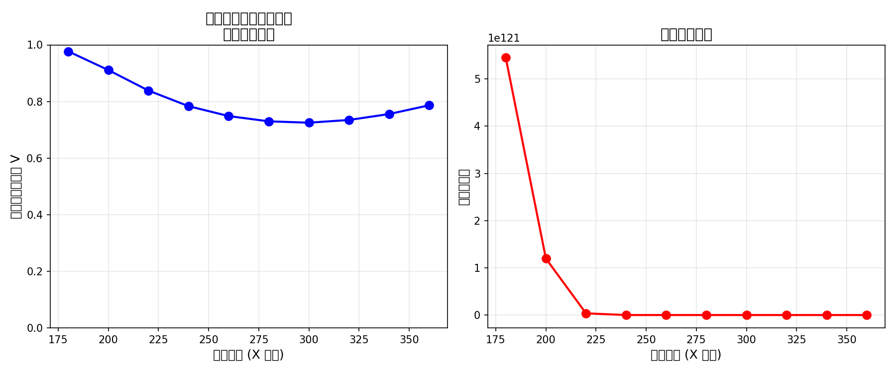

- **原理（AI）：** 固定双缝，扫描屏列位置（等效传播距离），用脚本定义的 `compute_visibility` 得 V 并作图。
- **假设：** V 与总能量未归一化时的暴涨量级脱钩，仅看相对起伏；见上文 `ce_01` 小节。

**Measurement / absorption at slit (`ce_04`)** / 缝后吸收对条纹的影响：

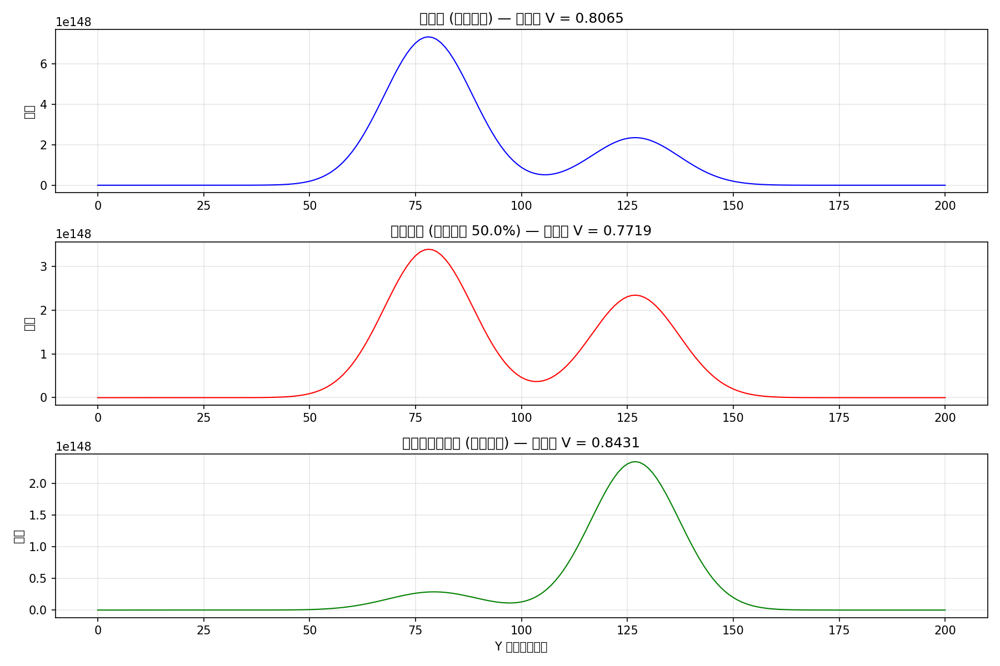

- **原理（AI）：** 缝列邻域按可调比例抽取能量（`propagate_double_slit_slit_absorb`），对比无吸收/部分/强吸收屏纹。
- **假设：** 吸收为离散 toy 档位，不含真实探测器光谱响应；见上文 `ce_04` 小节。

**Measurement parameter scan (`ce_07`)** / 测量参量扫描：

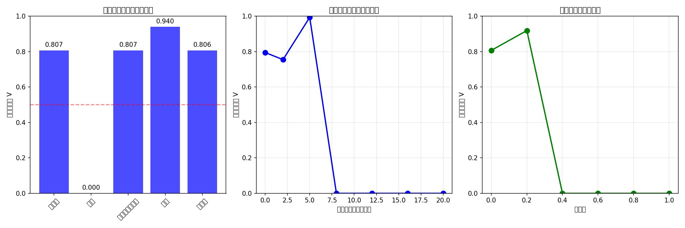

- **原理（AI）：** 嵌套扫描吸收体位置、尺度、吸收率等多维参量，子图展示屏上形态。
- **假设：** 扫描仅为稀疏网格示意，非参数空间完备搜索；见上文 `ce_07` 小节。

**Entanglement-style split packets with phase (`ce_09`)** / 分裂波包与相位场：

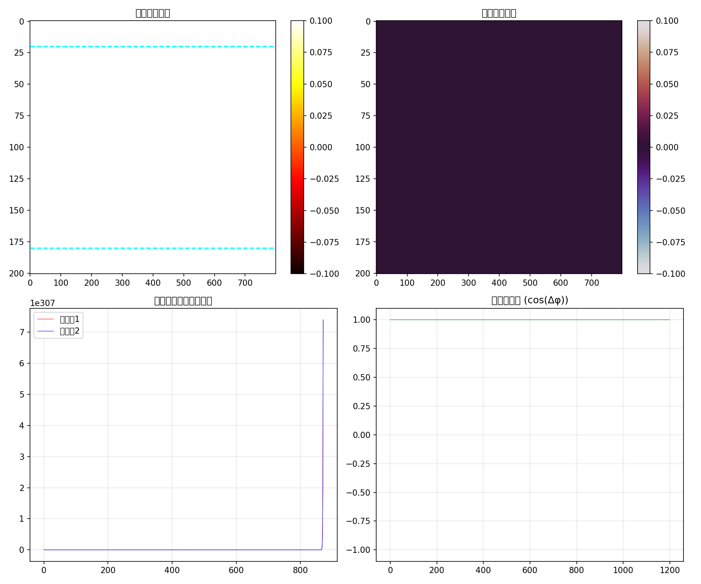

- **原理（AI）：** `propagate_split_phase` 同时在两分支格点上更新标量能量与相位场并可视化。
- **假设：** 「纠缠」为格点规则叙事，相位更新为本模型定义而非 QM 公理直接推出；见上文 `ce_09` 小节。

---

## Installation / 安装与运行

```bash
python -m venv .venv

# Windows
.venv\Scripts\activate

# Linux / macOS
# source .venv/bin/activate

pip install -r requirements.txt
python ce_00_double_slit_demo.py

# 一键重跑全部仿真并检查 PNG（可选）
# python run_all_simulations.py
```

依赖见根目录 **`requirements.txt`**：**`numba` 为必选**（所有 `ce_*` 传播主循环均通过其加速）；另需 `numpy`、`matplotlib`。

---

## Originality / 原创声明

This model and the code in this repository are **independently developed** by the author. Public Git history and timestamps may serve as one form of documentation of priority; formal scientific priority follows journal and community norms.

本模型与本仓库代码为作者**独立实现**。公开提交历史与时间戳可作为优先权的辅助记录；正式学术优先权仍遵循期刊与学界惯例。

---

## License / 许可

Code is released under the **MIT License** — see [`LICENSE`](LICENSE) for the full text. You must **keep the copyright and permission notice** in substantial portions of the Software (standard MIT condition).

学术或技术报告中若使用本仓库的思想、图像或结论，**建议**引用并注明仓库链接，以利于可重复性与致谢（MIT 本身不强制论文引用格式）。

The Software is provided “as is”, without warranty of any kind.
