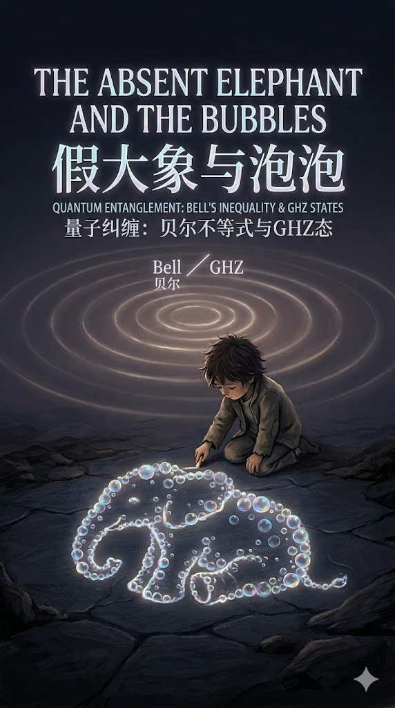

<!--
  书面封面 · Markdown 与正式封面图
  目录与全书：见 [02-contents.md](02-contents.md)
-->

# 封面图

正式设计稿（印刷 / 发布用）：

**图上文案（与内文「工作副题」可并存：图偏量子主题，内文偏审计手记）**

| 位置 | 英文 | 中文 |
| :--- | :--- | :--- |
| 主书名 | THE ABSENT ELEPHANT AND THE BUBBLES | 假大象与泡泡 |
| 副题 | QUANTUM ENTANGLEMENT: BELL'S INEQUALITY & GHZ STATES | 量子纠缠：贝尔不等式与 GHZ 态 |

> **Absent 与 Fake**  
> 画面英文用 *Absent*（缺席的大象），序言与目录里常用「假大象」比喻——二者同一意象：**谁也没摸全的那头象**。对内文统一用词无冲突时，以外宣、封面英文 *Absent* 为准即可。

**资源路径**：`book/image/cover.jpg`（仓库内相对本文件为 `image/cover.jpg`）

---

# 纯文字版式（无图预览、或扉页）

**━ ━ ━ ━ ━ ━ ━ ━ ━ ━ ━ ━ ━ ━ ━ ━ ━ ━ ━ ━ ━ ━ ━ ━ ━ ━ ━**

 

# 假大象与泡泡

 

### 公开数据、Bell/GHZ 与读数规则的审计手记

 

*The Absent Elephant and the Bubbles*（与封面主英文对齐时）  
*The Fake Elephant and the Bubble*（与序言「假大象」对齐时）

 

**━ ━ ━ ━ ━ ━ ━ ━ ━ ━ ━ ━ ━ ━ ━ ━ ━ ━ ━ ━ ━ ━ ━ ━ ━ ━ ━**

  

王　辉　·　Hui Wang  

**2026**

  

---

**腰封一句（内文 pitch）**

*用球面泡泡的直觉搭一座假大象，再用公开记录问：换一把统计的尺子，故事会不会变。*

---

## 书脊建议

`假大象与泡泡`  
`王辉 · 2026`

---

## 封底文案（可选用）

本书从「光像不断胀大的泡泡、探测器只摸到一点」这一直觉出发，把同一套图景写进**格子上的可运行模拟**；继而用**公开实验数据**说明：**同一批记录，只改读数与后处理，Bell 型指标可以从约 1.1 跳到约 2.3**。全书把**模型内数值**与**对记录、协议、分母的审计**分开写清，并诚实标出**尚未钉死**的边界——不是盖棺定论的教科书，而是一份**可对照仓库复现**的手记。

**相关仓库**：`chain-explosion-model`（正文稿见 `book/` 目录）

---

# Cover (English mirror)

<!--
  Print cover · Markdown and final cover image
  Full TOC: [02-contents.md](02-contents.md)
-->

## Cover image

Final design (print / release):

**On-image copy** (can coexist with the in-book “audit notes” subtitle: the art leans quantum; the interior leans protocol audit)

| Placement | English | Chinese |
| :--- | :--- | :--- |
| Main title | THE ABSENT ELEPHANT AND THE BUBBLES | 假大象与泡泡 |
| Subtitle | QUANTUM ENTANGLEMENT: BELL'S INEQUALITY & GHZ STATES | 量子纠缠：贝尔不等式与 GHZ 态 |

> **Absent vs fake**  
> The cover uses *Absent* (the elephant no one fully sees); the preface and TOC often say “fake elephant.” Same image: **nobody has the whole elephant.** For outward-facing English, *Absent* on the cover is fine.

**Asset path**: `book/image/cover.jpg` (relative to this file: `image/cover.jpg`)

---

## Text-only layout (no image preview, or half-title page)

**━ ━ ━ ━ ━ ━ ━ ━ ━ ━ ━ ━ ━ ━ ━ ━ ━ ━ ━ ━ ━ ━ ━ ━ ━ ━ ━**

 

# The Fake Elephant and the Bubbles

 

### Notes on auditing readout rules in public data and Bell/GHZ-style experiments

 

*The Absent Elephant and the Bubbles* (when aligned with cover English)  
*The Fake Elephant and the Bubble* (when aligned with the preface metaphor)

 

**━ ━ ━ ━ ━ ━ ━ ━ ━ ━ ━ ━ ━ ━ ━ ━ ━ ━ ━ ━ ━ ━ ━ ━ ━ ━ ━**

  

Hui Wang

**2026**

  

---

**Jacket one-liner (interior pitch)**

*Start from the intuition that light spreads like an expanding bubble while detectors sample a point; then ask the public record: if we change the statistical yardstick, does the story change?*

---

## Spine suggestion

`The Fake Elephant and the Bubbles`  
`Hui Wang · 2026`

---

## Back-cover copy (optional)

This book starts from the picture that **light behaves like an ever-growing bubble and a detector touches only a patch**, then implements the same image as **runnable lattice simulations**; it uses **public experimental data** to show that **on one fixed event table, changing readout and post-processing alone can move a Bell-type figure from about 1.1 to about 2.3**. **In-model numerics** are kept **separate** from **audits of records, protocols, and denominators**, and **unfinished** boundaries are labeled honestly — not a closed textbook, but a **repo-reproducible** lab notebook.

**Repository**: `chain-explosion-model` (manuscript under `book/`)
