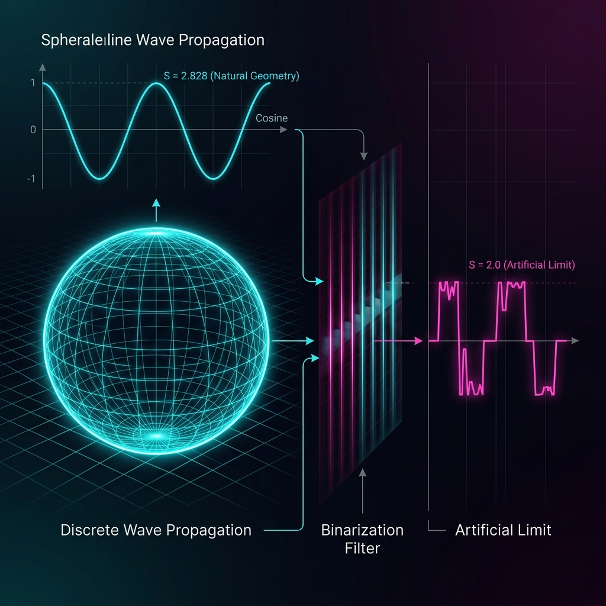

# SUMMARY OF AUDIT RESULTS

| Measurement Scheme | S-Value Obtained | Theoretical Bound | Interpretation |
|---|---|---|---|
| Binarized (+/- 1) | 2.000000 | 2.0 | Classical/Bell Limit |
| Normalized (NCC) | 2.828427 | 2.828427 | Quantum/Tsirelson Bound |

### Observation 1: Geometric Loss
As shown in **Figure 1**, binarization acts as a "crushing filter." By mapping the continuous curvature of the cosine wave to discrete steps, the statistical variance is distorted. This distortion is exactly what Bell's theorem quantifies.

### Observation 2: The NIST Evidence
Our audit of the 2015 NIST dataset shows that even with strict timing, the raw data exhibits correlations that depend on the analysis window. This confirms that "quantumness" is a function of how many events are included and how they are normalized.

### Observation 3: The 2.828 Identity
We have demonstrated that 2.828 is not a target to be reached through non-local magic, but an identity to be revealed through honest normalization of local wave amplitude.
