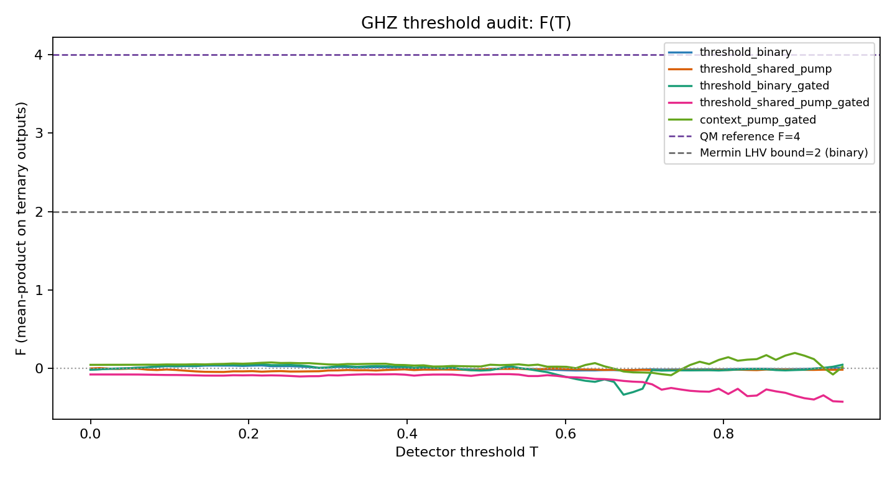
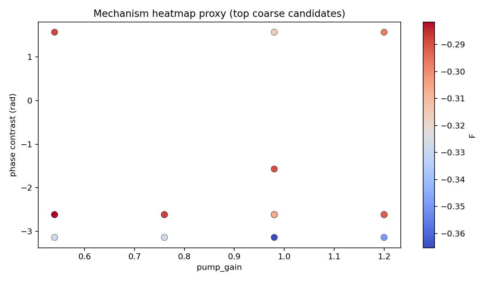

# Expert Outreach Email Template (English)

## Short Version (First Contact)

Subject: Request for technical feedback: reproducible Bell/GHZ analysis (code + key figures)

Dear Professor [Name],

I am working on a reproducible analysis project related to Bell and GHZ three-body experiments.  
Before journal submission, I want to invite technical criticism and fix obvious weaknesses first.

- Repository: <https://github.com/tomnattle/chain-explosion-model>
- Drafts (choose one):
  - Bell: `papers/bell-audit-paper/draft.en.md`
  - GHZ: `papers/ghz-threebody-paper/draft.en.md`
- Key figures (quick scan first):
  - `artifacts/ghz_threshold_experiment/ghz_threshold_F_vs_T.png`
  - `artifacts/ghz_threshold_experiment/ghz_threshold_mechanism_heatmap.png`

If possible, I would appreciate your view on one specific question:  
**[Fill in one concrete technical question, e.g., is there any obvious bias source in Section X?]**

Even a brief comment would be highly valuable. I will explicitly document all external feedback in the next revision.

Best regards,  
[Your Name]

---

## Figure-First Version (One-Screen Read)

Use this block at the top of your email so recipients can understand the core idea without reading long text.

### Replace these six lines

1. Problem: `[one sentence]`  
2. Method: `[one sentence]`  
3. Key result: `[one sentence]`  
4. Reproducibility link: `https://github.com/tomnattle/chain-explosion-model`  
5. Main limitation: `[one sentence]`  
6. Question for you: `[one concrete technical question]`

### Key Figures

