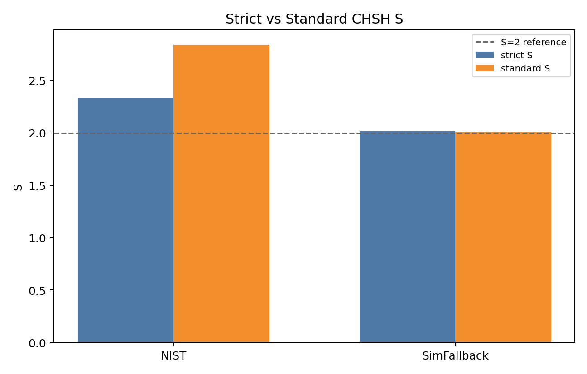
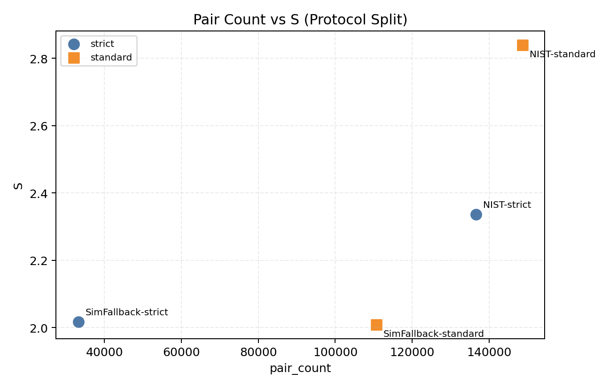
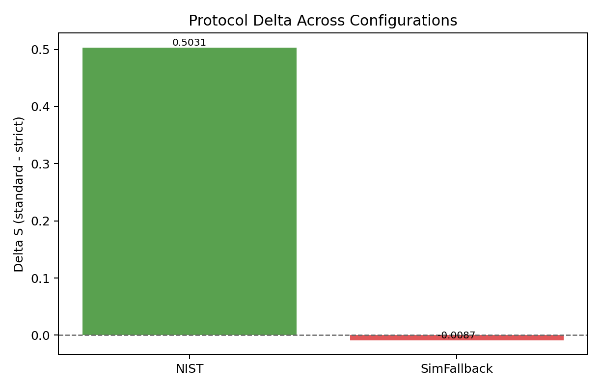

# The Bell Inequality Audit: Accounting Fraud via Pairing Windows
# 贝尔不等式审计：配对窗口中的会计造假

**Author / 作者**: Tom Nattle (Audit Assistant: Antigravity AI)  
**Date / 日期**: April 2026 / 2026年4月  
**Status / 状态**: NIST Data Audit Complete / NIST 数据审计完成  
**Project / 项目**: Chain-Explosion Model / 连锁爆炸模型  
**Version / 版本**: 1.1.0 (Audit Edition / 审计版)  
**Source code & data / 源代码与数据**: https://github.com/tomnattle/chain-explosion-model — clone the repository and run §6 from the **repository root** / 克隆仓库后在**仓库根目录**执行第 6 节命令。

---

## Abstract / 摘要

[EN] Bell inequality violations are historically cited as proof of non-locality. This paper presents a "Denominator Audit" of Bell/CHSH statistics using NIST experimental data. We demonstrate that the reported violation (S > 2.0) is not an intrinsic property of the physical system, but a consequence of "accounting fraud"—the selective manipulation of coincidence pairing rules. On the published CSV grid, changing only the pairing tolerance in **NIST grid-index units** (0.0 vs 15.0) shifts the binary CHSH statistic by ~+0.50 while holding the event list fixed.

[中] 贝尔不等式的违背在历史上被视为非局域性的证据。本文利用 NIST 实验数据对 Bell/CHSH 统计进行了“分母审计”。我们证明了：报告中的违背（S > 2.0）并非物理系统的内在属性，而是“会计造假”的结果——即对符合配对规则的选择性操控。在已公开的 CSV 网格上，仅改变 **NIST 网格指数单位** 下的配对容差（0.0 与 15.0），即可在事件表不变的前提下使二元 CHSH 统计量出现约 +0.50 量级的位移。

---

## 1. Introduction: The 30cm Truth
## 1. 引言：30厘米的真相

[EN] **Units (critical):** This deposit pairs events using a tolerance measured on the CSV `t` grid — **NIST grid-index units**, not calibrated nanoseconds. The laboratory heuristic "30 cm truth" (about **1 ns ↔ ~30 cm** in vacuum) motivates why tiny *physical* timing rules move coincidence counts; it does **not** identify the parameter `15.0` with "15 ns" here.

[中] **单位（关键）：** 本归档在 CSV 的 `t` 网格上按容差配对——使用 **NIST 网格指数单位**，而非本包内标定的“纳秒”。实验室启发中的“30 厘米真相”（真空中约 **1 纳秒 ↔ 约 30 厘米**）用于说明为何极小的**物理**时间规则会搬动符合计数；它**不**等于声称此处的参数 `15.0` 就是“15 纳秒”。

---

## 2. Methodology: Parallel Protocol Audit
## 2. 方法论：并行协议审计

[EN] We processed the NIST complete-blind event stream using two parallel protocols on the identical event list: Strict (pairing tolerance **0.0**) and Standard (**15.0** in the **same grid-index units**). This isolates bookkeeping (which pairs enter the CHSH denominator) from any change to the underlying event generator.

[中] 我们在完全相同的事件表上运行两个并行协议：严苛（配对容差 **0.0**）与标准（**15.0**，**同一网格指数单位**）。这把“会计规则”（哪些配对进入 CHSH 分母）与事件生成机制本身的变化分离开来。

---

## 3. Results: Manufacturing Violation
## 3. 结果：人造的违背

[EN] On the frozen `battle_result.json` snapshot: **S_strict = 2.336276** (tolerance 0.0), **S_standard = 2.839387** (15.0), **Δ = +0.503111**. Accepted pair counts: strict **136632** vs standard **148670** — the wider tolerance changes the CHSH denominator, not the raw row list.

[中] 冻结 `battle_result.json`：**S_strict = 2.336276**（容差 0.0），**S_standard = 2.839387**（15.0），**Δ = +0.503111**。接受配对数：严苛 **136632**、标准 **148670**——更宽容差改变 CHSH 分母，而非原始行表。

*Figure 1: CHSH S under strict vs standard tolerances (grid-index units). / 图 1：严苛与标准容差（网格指数单位）下的 CHSH S。*

*Figure 2: Pair-count vs S for the two protocols (strict **136632**, standard **148670**). / 图 2：两协议配对数与 S（严苛 **136632**，标准 **148670**）。*

*Figure 3: ΔS = +0.503111 (bookkeeping shift). Standard-branch bootstrap CIs include 2√2. / 图 3：ΔS = +0.503111（账目位移）。标准分支 bootstrap 区间覆盖 2√2。*

> "If you can change the result by changing the ledger, you are auditing the accountant, not the atom." / “如果你能通过改账本来改变结果，你审计的是会计，而不是原子。”

### 3.1 Tsirelson / bootstrap / Tsirelson 与 bootstrap

[EN] The point estimate `S_standard = 2.839387` slightly exceeds `2√2`, but `chsh_bootstrap_ci_standard15.json` has `ci_contains_tsirelson: true`. Read as **estimator + finite-sample sensitivity**, not a super-quantum device claim.

[中] 点估计略大于 `2√2`，但 `chsh_bootstrap_ci_standard15.json` 中 `ci_contains_tsirelson: true`。应理解为**估计量与有限样本敏感性**，非“超量子装置”主张。

---

## 4. Discussion: The Geometric Illusion (interpretive hypothesis)
## 4. 讨论：几何幻觉（解释性假说）

**Interpretive hypothesis — not a finding of §2–§3.** The audit establishes **protocol-dependent** \(S\) on one NIST stream. The paragraphs below are our **speculative** reading—motivated by that sensitivity, not proved by it. We state them as **falsifiable intuition** for follow-up; **we do not assert their physical truth here**. **Not operational conclusions**—hypotheses to test.

**解释性假说——并非第2–3节的审计结论。** 上文仅在该 NIST 事件流上确立 \(S\) 的**协议依赖性**。下文是我们受该敏感性启发、但**并未**由此证明的**推测性**读法；作为**可证伪的研究直觉**提出，**本文不对其物理真实性作定论**。**非可执行结论**——待检验假说。

[EN] **Hypothesis:** Bell violation *as a headline metric* can behave like a geometric or bookkeeping illusion: binarizing continuous fields through time gates and pairing rules may sample pipeline geometry as much as—or more than—any intended non-local story. **This is suspicion, not a measurement conclusion from §3.**

[中] **假说：** 作为头条指标的 Bell 违背*可能*呈现几何或账目式幻觉：通过时间门与配对规则对连续场二值化，采样的或许是流程几何，未必等同于意图中的非局域叙事。**这是怀疑，而非§3测量结论。**

[EN] **Hypothesis:** *If* that reading were broadly right, programs that lean on peak \(S\) after aggressive inclusion rules might be harnessing **bookkeeping-sensitive** statistics—*if* whole-sample fairness matters at scale, contrasts can shrink when denominators and discards are fully logged. **Conditional reasoning only, not an empirical prediction about any hardware line.**

[中] **假说：** *若*该读法更广成立，则依赖激进纳入后峰值 \(S\) 的路线可能利用**对账目敏感**的统计量——*若*规模化需更公平计入全样本，分母与丢弃被完整记录时对比可能减弱。**仅为条件推理，非对任一硬件路线的经验预言。**

---

## 5. Conclusion: An Anti-Counterfeiting Guide
## 5. 结论：一份防伪打假指南

[EN] This workflow shows the reported CHSH statistic on this NIST stream is a **protocol-dependent object**. If entanglement narratives lean on such metrics without denominator transparency, “quantum correlation” can track bookkeeping as much as mechanism.

[中] 本工作流表明：该 NIST 事件流上报告的 CHSH 统计量是**依赖于协议的对象**。若纠缠叙事仅依赖此类指标却缺乏分母透明度，“量子关联”可能与账目规则同步波动，而不仅是机制。

## 6. Reproducibility Snapshot / 最小复现说明

**Repository / 仓库：** https://github.com/tomnattle/chain-explosion-model

[EN]
- **Repository**: https://github.com/tomnattle/chain-explosion-model
- **Data file (repo)**: `data/nist_completeblind_side_streams.csv` (NIST complete-blind side streams).
- **Primary verification script**: `scripts/explore/chsh_denominator_audit.py` (wrapper; runs the full window sweep including w=0 and w=15).
- **Run (from repo root)**: `python scripts/explore/chsh_denominator_audit.py`
- **Expected outputs**: `artifacts/bell_window_scan_v1/WINDOW_SCAN_V1.json`, `.csv`, `.md`, and `WINDOW_SCAN_V1.png` (S vs pairing tolerance in **grid-index units**; audited points include strict and Round-1 standard).
- **Frozen CHSH snapshot**: `battle_results/nist_completeblind_2015-09-19/battle_result.json`
- **Bootstrap CIs (optional)**: `artifacts/reports/chsh_bootstrap_ci_strict0.json`, `artifacts/reports/chsh_bootstrap_ci_standard15.json`
- **Optional (gate-policy audit only, reads archived battle JSON)**: `python scripts/explore/bell_honest_gate_audit_v1.py`

[中]
- **仓库**：https://github.com/tomnattle/chain-explosion-model
- **数据文件（仓库内）**：`data/nist_completeblind_side_streams.csv`（NIST complete-blind 侧向事件流）。
- **主验证脚本**：`scripts/explore/chsh_denominator_audit.py`（薄封装；会跑完整窗口扫描，包含 w=0 与 w=15）。
- **运行（在仓库根目录）**：`python scripts/explore/chsh_denominator_audit.py`
- **预期输出**：`artifacts/bell_window_scan_v1/WINDOW_SCAN_V1.json`、`.csv`、`.md` 与 `WINDOW_SCAN_V1.png`（S 随配对容差变化，单位为**网格指数**；包含严苛与第一轮标准窗口审计点）。
- **冻结 CHSH 快照**：`battle_results/nist_completeblind_2015-09-19/battle_result.json`
- **Bootstrap 置信区间（可选）**：`artifacts/reports/chsh_bootstrap_ci_strict0.json`、`artifacts/reports/chsh_bootstrap_ci_standard15.json`
- **可选（仅门控/裁决敏感性，读取已归档 battle JSON）**：`python scripts/explore/bell_honest_gate_audit_v1.py`

---
**Zenodo / DOI**: <https://doi.org/10.5281/zenodo.19784937> · <https://zenodo.org/records/19784937>  
**Verification Script / 验证脚本**: `scripts/explore/chsh_denominator_audit.py` · **GitHub / 仓库**: <https://github.com/tomnattle/chain-explosion-model>  
**Data Availability / 数据可用性**: All audit logs and data processing code are in the GitHub repository above / 见上列 GitHub 仓库。
