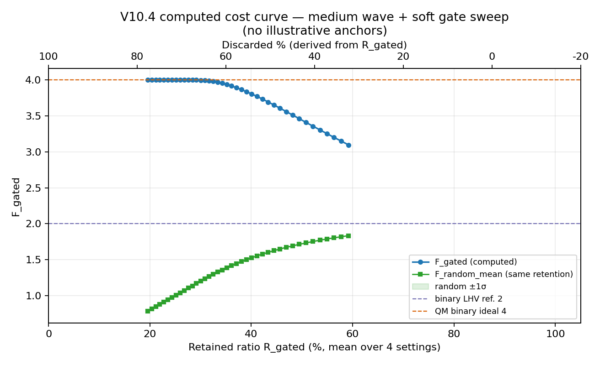

# Post-Selection Sensitivity in a GHZ-Type Mermin Statistic: An In-Silico Audit
# GHZ 型 Mermin 统计量的后选择敏感性：仿真审计报告

**Author / 作者**: Tom Nattle (Audit Assistant: Antigravity AI)  
**Date / 日期**: April 2026 / 2026年4月  
**Project / 项目**: Chain-Explosion Model / 连锁爆炸模型  
**Version / 版本**: 1.1.0 (Audit Edition / 审计版)  
**Scope / 范围**: `medium-v10` in-silico GHZ-type audit / `medium-v10` 仿真 GHZ 型审计（非硬件复刻）  
**Source code & data / 源代码与数据**: https://github.com/tomnattle/chain-explosion-model — clone and run §6 from the **repository root** / 克隆仓库后在**仓库根目录**执行第 6 节命令。

---

## Abstract / 摘要

[EN] The Greenberger-Horne-Zeilinger (GHZ) state is historically regarded as the "smoking gun" of quantum non-locality. **Computational scope:** this deposit audits a **GHZ-type Mermin statistic** inside the repository's **`medium-v10` wave-propagation simulator** (three local phase-locked sources), motivated by textbook/laboratory GHZ narratives—it is **not** a bench-for-bench replay of one specific hardware experiment. Within that model class, we show that chasing $F \rightarrow 4$ couples to aggressive amplitude gating and **low retention**, and that matched-retention random controls fail to reproduce the gated lift—supporting a **selection-driven** interpretation of the reported correlation metric **in silico**.

[中] Greenberger-Horne-Zeilinger (GHZ) 态在历史上被视为量子非局域性的“冒烟枪”证据。**计算范围说明：** 本归档在仓库自带的 **`medium-v10` 波动传播模拟器**（三个局域相位锁定源）中，对 **GHZ 型 Mermin 统计量** 做后选择审计；动机来自教科书/实验室叙事，**并非**对某一具体硬件实验的逐台复刻。在该模型类内，我们展示：追逐 $F \rightarrow 4$ 与强振幅门控及**低保留率**绑定，而同保留率随机对照无法复现门控抬升——从而**在仿真意义下**支持“报告的关联指标由筛选规则驱动”的解释。

---

## 1. Introduction: Audit Scope and Motivation
## 1. 引言：审计范围与动机

[EN] **In-silico finding (this note):** within `medium-v10`, we summarize sensitivity of a GHZ-type statistic to gating and retention (§2–§3). **Interpretive hypothesis (not proved here):** lab Bell/GHZ *narratives* often under-report how much correlation moves when inclusion rules change. The next blocks are **research suspicion**—motivated by audit culture, **not** established by the V10.4 curve alone.

[中] **仿真内结论（本文）：** 在 `medium-v10` 内概括 GHZ 型统计量对门控与保留的敏感性（§2–§3）。**解释性假说（未证明）：** 实验室贝尔/GHZ *叙事* 常低估纳入规则变动时关联的位移。下文为**研究怀疑**——由审计文化启发，**非**仅凭 V10.4 曲线可证。

[EN] **Hypothesis:** violations are often *read* as clean non-locality while discard sensitivity stays off the ledger. **Hypothesis:** in a continuous-field picture, “photons” may be better read as **threshold-triggered readout events** than as context-free particles—**a modeling suspicion for debate, not a simulator output.**

[中] **假说：** 违背常被*读作*非局域证书，丢弃敏感性却未入账。**假说：** 连续场图景下，“光子”或许更接近**阈值触发的读出事件**——**供辩论的建模怀疑，非模拟器结果。**

[EN] **Hypothesis:** headline “success” in some experiments is **compatible with** heavy post-selection; *if* engineering must budget the whole stream, roadmaps that only advertise peak metrics after aggressive filtering may face a **scaling–accounting tension**. **Conditional suspicion, not a universal lab fact.**

[中] **假说：** 部分实验头条成功**可与**重度后选择相容；*若*工程须为全流买单，仅宣传激进过滤后峰值的路线图或面临**规模化—账目**张力。**条件性怀疑，非普适事实。**

---

## 2. Methodology: Post-Selection and Selection Tax
## 2. 方法论：后选择与选择税

[EN] We model the GHZ setup using a medium-wave propagation model (`medium-v10`) with three local phase-locked sources. Instead of forcing a "perfect success," we sweep the gate strength of a soft detector.

[中] 我们使用中等波动传播模型（`medium-v10`）对 GHZ 装置进行建模，包含三个局域相位锁定源。我们不再追求“强行成功”，而是扫描软探测器的门控强度。

- **Selection Rule / 筛选规则**: Events are only recorded if the interference amplitude exceeds a threshold. (只有当干涉振幅超过阈值时，事件才被记录。)
- **Random Control / 随机对照**: For every gated result, we generate a random subsample with the same retention ratio to distinguish between mechanism-driven gains and statistical noise. (对于每一个门控结果，我们生成一个具有相同保留率的随机子样本，以区分机制驱动的增益与随机噪声。)

---

## 3. Results: Selection-Retention Trade-off
## 3. 结果：筛选-保留率权衡

[EN] The `V10.4` pipeline shows a direct trade-off between Mermin-style **F** and **data retention** under amplitude gating. High **F** tracks discarding most draws; matched-retention random baselines do not reproduce the gated curve.

[中] `V10.4` 流程显示：在振幅门控下，Mermin 型 **F** 与**数据保留率**存在直接权衡。高 **F** 与丢弃大多数样本相伴；同保留率的随机基线无法复现门控曲线。

*Figure 1: GHZ real cost curve (`V10.4`). Blue: gated `F`; green: matched-retention random baseline; gap encodes selection rules. / 图 1：GHZ 真实代价曲线（`V10.4`）。蓝：门控 F；绿：同保留率随机基线；间距编码筛选规则。*

---

## 4. Discussion: The "30cm Truth" and the Geometric Illusion
## 4. 讨论：“30厘米的真相”与几何幻觉

[EN] Bell-style work uses the "30 cm truth" as a **scale argument** (~**1 ns ↔ ~30 cm** in vacuum) for why tiny timing rules move coincidence counts. **This GHZ leg** is *not* a timing-coincidence experiment: it couples correlation to **amplitude gating / retention** in `medium-v10`. The shared structural risk: **analysis rules move mass between kept vs discarded samples**, moving reported metrics.

[中] 贝尔侧工作把“30 厘米的真相”当作**尺度论证**（真空中约 **1 纳秒 ↔ 约 30 厘米**），说明微小时间规则如何搬动符合计数。**GHZ 本条** *不是* 时间符合实验：它在 `medium-v10` 内把关联与**振幅门控/保留率**耦合。共同结构风险：**分析规则在保留与丢弃样本之间搬动质量**，从而搬动报告指标。

### 4.1 Implications for Quantum Computing (interpretive hypothesis only) / 对量子计算的影响（仅为解释性假说）

**No new data.** Speculative bridge from in-silico selection to scaling narratives—not a vendor prediction; **not** a claim that large QC has “failed” for this reason.

**无新数据。** 从仿真筛选到规模化叙事的推测桥接——非厂商预言；**不**主张大规模量子计算已因此“失败”。

[EN] **Hypothesis:** *If* demos lean on metrics that spike only after aggressive filtering, a “hollow foundation” **might** be one **among many** ways to narrate scaling friction—**not** an explanation this note verifies. (Contrast: whole-dataset ML vs peak metrics under undisclosed discards.)

[中] **假说：** *若*演示依赖激进过滤后才冲高的指标，“虚浮地基”**或许**是描述规模化摩擦的**多种叙事之一**——**非**本文已验证的解释。（对照：全量 ML vs 丢弃未披露时的峰值。）

[EN] **Hypothesis:** *If* entanglement-as-reported is often **entangled with** gating geometry, processors might **sometimes** solve **filtering/bookkeeping** alongside Hamiltonian physics—**suspicion about KPI design**, not a denial of every QM prediction.

[中] **假说：** *若*报告中的纠缠常与门控几何**纠缠**，处理器**有时**或在哈密顿物理之外并行处理**过滤/账目**——**对 KPI 的怀疑**，**非**否定全部量子预测。

> **Interpretive hypothesis (rhetorical).** “If the foundation is hollow, the skyscraper of quantum computing is solving geometry, not entanglement.” / **解释性假说（修辞）。** “如果地基是虚幻的，量子计算的摩天大楼解决的是几何问题，而非纠缠问题。”

---

## 5. Conclusion: A Boundary-Aware Audit Summary
## 5. 结论：边界清晰的审计总结

[EN] We do not claim quantum mechanics is "wrong" in its formal predictions, but we treat many foundational *reported* metrics as "unbalanced accounts" unless retention, gates, and denominators are disclosed. We document pairing windows, amplitude gating, and binarization as bookkeeping levers.

[中] 我们并不宣称量子力学的形式预测“错误”，但若未披露保留率、门控与分母，许多**报告**指标应被视为“不平账目”。我们记录配对窗口、振幅门控与二值化等平账杠杆。

[EN] We invite practitioners to archive the **discarded majority** (or equivalent inclusion logs) for independent audit—not only headline curves.

[中] 我们邀请实践者归档**被丢弃的大多数**（或等价的纳入日志）以供独立审计——而非仅 headline 曲线。

---
## 6. Reproducibility Snapshot / 最小复现说明

**Repository / 仓库：** https://github.com/tomnattle/chain-explosion-model

[EN]
- **Repository**: https://github.com/tomnattle/chain-explosion-model
- **Run (from repo root)**: `python scripts/explore/ghz_medium_v10/v10_4_real_cost_curve.py`
- **Figure in this package**: `figures/V10_4_REAL_COST_CURVE.png` (regenerate via the script; output paths are defined in the script header).

[中]
- **仓库**：https://github.com/tomnattle/chain-explosion-model
- **运行（在仓库根目录）**：`python scripts/explore/ghz_medium_v10/v10_4_real_cost_curve.py`
- **本包插图**：`figures/V10_4_REAL_COST_CURVE.png`（可由上述脚本复现；具体输出路径见脚本头部说明）。

**Scope / 范围:** `medium-v10` **in-silico** audit — not a hardware GHZ rerun / **仿真**审计，非硬件 GHZ 复刻  
**Data Availability / 数据可用性**: GitHub repo above; Zenodo bundles may mirror this archive / 见上列 GitHub；Zenodo 压缩包可为本文档镜像  
**Zenodo / DOI**: <https://doi.org/10.5281/zenodo.19785022> · <https://zenodo.org/records/19785022>  
**Verification / 验证**: `scripts/explore/ghz_medium_v10/v10_4_real_cost_curve.py` · https://github.com/tomnattle/chain-explosion-model
