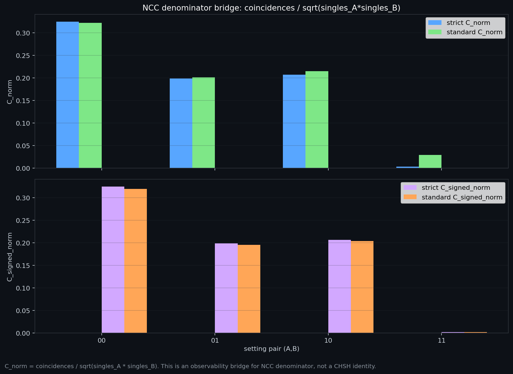

# The Audit Trilogy: Bell Denominator Audit + GHZ V10.4 Computed Cost Curve
# 审计三部曲：贝尔分母审计 + GHZ V10.4 计算代价曲线

**Author / 作者**: Tom Nattle (Audit Assistant: Antigravity AI)  
**Date / 日期**: April 2026 / 2026年4月  
**Project / 项目**: Chain-Explosion Model / 连锁爆炸模型  
**Version / 版本**: 1.2.0 (Trilogy anchored to **V10.4** — `v10_4_real_cost_curve.py`; **not** `ghz_loop_explosion_v19.py`)  
**Source code & data / 源代码与数据**: https://github.com/tomnattle/chain-explosion-model — clone and run §6 from the **repository root** / 克隆仓库后在**仓库根目录**执行第 6 节命令。

---

## Abstract / 摘要

[EN] This trilogy documents two **frozen, reproducible** workflows. **(i) Bell leg:** binary CHSH on the public NIST complete-blind CSV; coincidence **pairing tolerances** are **NIST grid-index units** on the exported `t` column (not seconds in this repository). **(ii) GHZ leg:** the **computed** “real cost curve” produced by **`scripts/explore/ghz_medium_v10/v10_4_real_cost_curve.py`** (model id **`ghz_medium_v10`**): a single fixed RNG phase sample is swept under a **soft amplitude gate** parameterized by **`gate_k`**; each point reports **`F_gated`**, the simultaneous-hit **retention `R_gated`**, and a **matched-retention random control** (`F_random_mean ± 1σ`). Legacy exploratory code such as **`ghz_loop_explosion_v19.py`** (loop topology + ad-hoc burst threshold) is **out of scope** for this trilogy revision. **Claim (methodological):** in these two pipelines, headline correlation numbers move when **inclusion rules** change while the underlying row list (Bell) or phase sample (GHZ) stays fixed.

[中] 本三部曲记录两条**冻结、可复现**工作流。**（i）贝尔侧：** 公开 NIST complete-blind CSV 上的二元 CHSH；符合**配对容差**为导出列 `t` 上的 **NIST 网格指数单位**（本仓库**不**标定为秒）。**（ii）GHZ 侧：** 由 **`scripts/explore/ghz_medium_v10/v10_4_real_cost_curve.py`**（模型 **`ghz_medium_v10`**）生成的**计算型**「真实代价曲线」：在**同一份固定 RNG 相位样本**上，对软振幅门控参数 **`gate_k`** 做扫描；每点输出 **`F_gated`**、同时触中保留率 **`R_gated`**，以及**同保留率随机对照**（`F_random_mean ± 1σ`）。诸如 **`ghz_loop_explosion_v19.py`**（环路拓扑 + 爆发阈值启发）一类的旧探索脚本，**不在**本版三部曲证据链之内。**主张（方法论）：** 在这两条流程里，头条关联数字随**纳入规则**变动，而底层行表（Bell）或相位样本（GHZ）保持不变。

---

## 1. What This Package Is — and Is Not / 本包是什么、不是什么

## 1. 本包是什么、不是什么

[EN] **Is:** Bell audit numbers from `battle_results/nist_completeblind_2015-09-19/battle_result.json`; GHZ narrative from **`computed_curve`** artifacts (`V10_4_REAL_COST_CURVE.meta.json` states `type: computed_curve`). **Is not:** a bench replay of one hardware GHZ run; **not** a dependence on v19 “loop explosion” thresholds.

[中] **是：** 贝尔数字来自 `battle_results/nist_completeblind_2015-09-19/battle_result.json`；GHZ 叙事来自 **`computed_curve`** 产物（`V10_4_REAL_COST_CURVE.meta.json` 中 `type: computed_curve`）。**不是：** 某一硬件 GHZ 实验的逐台复刻；**不**依赖 v19「环路爆发」阈值叙事。

---

## 2. Synthesis of Evidence / 证据综合

### 2.1 Bell / CHSH / 贝尔

[EN] `S_strict = 2.336276` (tolerance 0.0) vs `S_standard = 2.839387` (15.0); pairs **136632** vs **148670**. Bootstrap file `chsh_bootstrap_ci_standard15.json`: `ci_contains_tsirelson: true`.

[中] `S_strict = 2.336276`（容差 0.0）对 `S_standard = 2.839387`（15.0）；配对数 **136632** / **148670**。Bootstrap：`chsh_bootstrap_ci_standard15.json` 中 `ci_contains_tsirelson: true`。

### 2.2 GHZ V10.4 (medium-v10) / GHZ V10.4

[EN] **Script:** `scripts/explore/ghz_medium_v10/v10_4_real_cost_curve.py`. **Physics stub:** three inner-ring sources; observers sum distance-weighted delayed cosines. **Sample:** default `states=120000`, `seed=20260423`. **Gating:** thresholds `gate_k × RMS` per channel; `F_gated` from simultaneous non-zero hits; `R_gated` = mean of four setting retentions. **Sweep:** `gate_k` default 0.35–0.95 (40 points). **Random control:** default 120 trials, seed 20260424, same per-setting counts as gated. **Canonical outputs:** `artifacts/ghz_medium_v10/V10_4_REAL_COST_CURVE.png`, `.csv`, `.meta.json`, `V10_4_REAL_COST_CURVE_REPORT.md`.

[中] **脚本：** `scripts/explore/ghz_medium_v10/v10_4_real_cost_curve.py`。**物理骨架：** 内环三源；观测点为带延迟、距离加权的余弦叠加。**样本：** 默认 `states=120000`，`seed=20260423`。**门控：** 每通道 `gate_k × RMS`；`F_gated` 来自三通道同时非零；`R_gated` 为四设定保留率均值。**扫描：** `gate_k` 默认 0.35–0.95（40 点）。**随机对照：** 默认 120 次试验，种子 20260424，各设定计数与门控一致。**规范产物：** `artifacts/ghz_medium_v10/` 下 PNG、CSV、meta.json、REPORT.md。

*Figure 1: V10.4 computed cost curve — blue `F_gated`, green `F_random_mean` ±1σ vs retained % (self-contained copy; regenerate via script). / 图 1：V10.4 计算代价曲线——蓝 `F_gated`，绿 `F_random_mean` ±1σ 对保留率（本包自包含拷贝；脚本可重算）。*

### 2.3 Optional: NCC bridge (Bell-side) / 可选：NCC 桥接（贝尔侧）

[EN] **Not part of V10.4.** `C_norm` diagnostic on NIST CSV — see `artifacts/reports/ncc_singles_bridge_real.json` (**observability bridge, not CHSH identity**).

[中] **不属于 V10.4。** NIST CSV 上 `C_norm` 诊断——见 `artifacts/reports/ncc_singles_bridge_real.json`（**可观测性桥接，非 CHSH 恒等式**）。

*Supplemental Bell-side figure / 贝尔侧补充图*

---

## 3. Interpretation Boundary / 解释边界

## 3. 解释边界

[EN] **Bell:** the `S` jump is pair-inclusion bookkeeping on fixed rows. **GHZ V10.4:** large `F_gated` at low `R_gated` is gating mechanics on a **classical wave model**; excess over `F_random_mean` at matched retention is a claim **inside this script**, not about a lab device.

[中] **贝尔：** `S` 跳变是固定行表上的符合纳入账目。**GHZ V10.4：** 低 `R_gated` 时高 `F_gated` 是**经典波模型**上门控机制；同保留率下相对 `F_random_mean` 的超出是**本脚本内**命题，非实验装置鉴定。

---

## 4. Implications for Quantum Computing (interpretive hypothesis) / 对量子计算的含义（解释性假说）

[EN] **Not established by §2.** Conditional, speculative reasoning—authors’ **research suspicion** about engineering KPIs if headline correlation inherits the same bookkeeping sensitivities audited above. **No claim** about any specific program’s success or failure.

[中] **非§2所确立。** 条件性、推测性推理——若头条关联继承上文账目敏感性，对工程 KPI 的**研究怀疑**。**不对**任一具体项目成败作断言。

[EN] **Hypothesis:** *If* production KPIs only peak after aggressive **post-selection**, roadmaps **may need** to budget **effective sample rate** and **inclusion logs**, not only peak `F` or `S`.

[中] **假说：** *若*工程指标仅在激进**后选择**后才冲高，路线图**或许需要**核算**有效样本率**与**纳入日志**，而非仅峰值 `F` 或 `S`。

> V10.4 documents a **computed** cost curve — not an illustrative sketch tied to legacy v19.  
> V10.4 记录的是**计算型**代价曲线——与旧版 v19 示意链脱钩。

---

## 5. Conclusion / 结论

[EN] Methodological bundle: **NIST pairing audit** + **V10.4 `computed_curve`**. Publish inclusion logs and RNG seeds with every headline plot.

[中] 方法论捆绑：**NIST 配对审计** + **V10.4 `computed_curve`**。 headline 图须配纳入日志与 RNG 种子。

---

## 6. Reproducibility Snapshot / 最小复现说明

**Repository / 仓库：** https://github.com/tomnattle/chain-explosion-model

[EN]
- **Bell:** `python scripts/explore/chsh_denominator_audit.py` · `data/nist_completeblind_side_streams.csv` · `battle_results/nist_completeblind_2015-09-19/battle_result.json`
- **GHZ V10.4:** `python scripts/explore/ghz_medium_v10/v10_4_real_cost_curve.py` → `artifacts/ghz_medium_v10/V10_4_REAL_COST_CURVE.*`
- **Excluded from this trilogy revision:** `scripts/explore/ghz_loop_explosion_v19.py`

[中]
- **Bell：** `python scripts/explore/chsh_denominator_audit.py` · `data/nist_completeblind_side_streams.csv` · `battle_results/nist_completeblind_2015-09-19/battle_result.json`
- **GHZ V10.4：** `python scripts/explore/ghz_medium_v10/v10_4_real_cost_curve.py` → `artifacts/ghz_medium_v10/V10_4_REAL_COST_CURVE.*`
- **本版排除：** `scripts/explore/ghz_loop_explosion_v19.py`

**Papers / 论文:** `papers_final/01_Bell_Audit`, `02_GHZ_Audit`, `03_Audit_Trilogy` · **Zenodo / DOI:** <https://doi.org/10.5281/zenodo.19785083> · <https://zenodo.org/records/19785083> · **GitHub / 仓库:** <https://github.com/tomnattle/chain-explosion-model>
