# Ripple Reality: A Rigid Parametric Unification Audit from Bell-Style Statistics to Compton-Style Shift (v6+v7+v8)
# Ripple Reality：从 Bell 样式统计到 Compton 样式位移的刚性参数统一审计（v6+v7+v8）

**Author / 作者**: wang, hui  
**Status / 状态**: Draft v1 (Merged v6+v7+v8)  
**Positioning / 定位**: Methodological audit and reproducibility claim / 方法学审计与可复现性主张

---

## Abstract / 摘要

**EN**  
We present a merged v6+v7+v8 audit under one fixed parameter triplet $(\mu,\rho,\eta)=(1.5495,2.35,0.08)$. v6 establishes cross-benchmark baseline consistency (laser threshold, semiconductor cutoff, MRI Larmor, atomic-clock modes). v7 establishes rigidity and anti-tuning evidence (local `27/27`, random-global `18/20`, expected-fail counterfactual suite, 7-seed spin stability). v8 tests deeper cross-scale functionality at the same locked point on radial standing-wave levels, environment decoherence, and Compton-style nonlinear shift, with anti-cheat closure (`eta=0.001` counterfactual fail, all negative controls fail, `100/100` multi-round hardening pass). The combined chain addresses three audit questions: baseline consistency (v6), parameter identifiability (v7), and deeper joint explanatory scope (v8).

**中**  
本文给出 v6+v7+v8 合并审计：在同一固定参数 $(\mu,\rho,\eta)=(1.5495,2.35,0.08)$ 下，v6 先建立跨基准基线一致性（激光阈值、半导体截止、MRI Larmor、原子钟模态）；v7 再建立刚性与反凑数证据（局部 `27/27`、全局随机 `18/20`、反事实套件按预期失败、7 种子自旋稳定）；v8 最后在同一锁定点完成深层跨尺度验证（径向驻波能级、环境退相干、类 Compton 非线性位移），并形成反作弊闭环（`eta=0.001` 反事实失败、负对照全部失败、`100/100` 多轮加固通过）。合并后可同时回答三类问题：v6 的基线一致性、v7 的参数可辨识性、以及 v8 的深层联合解释能力。

---

## 1. Audit Logic / 审计逻辑

**EN**  
This manuscript is intentionally merged. v6 is the baseline consistency layer, v7 is the rigidity foundation, and v8 is the cross-scale superstructure. Publishing separately weakens causal force; publishing jointly forms a closed evidence path.

**中**  
本文刻意合并。v6 是基线一致性层，v7 是刚性地基，v8 是跨尺度大厦。拆分发表会削弱因果链，合并发表可形成闭环证据路径。

---

## 2. Fixed Parameter Contract / 固定参数契约

\[
(\mu,\rho,\eta)=(1.549500,\,2.350000,\,0.080000)
\]

**EN**  
The same triplet is reused across v6, v7 and v8. v6 defines baseline consistency; v7/v8 are audited at the same locked point; no optimization is allowed in v8.

**中**  
同一参数三元组贯穿 v6、v7 与 v8：v6 定义基线一致性，v7/v8 在同一锁定点继续审计，且 v8 阶段不允许再次优化。

---

## 3. Section v6: Baseline Joint Consistency / 第三节：v6 基线联合一致性

**EN**  
v6 provides the baseline four-benchmark joint consistency under the same shared triplet: `laser_threshold`, `semiconductor_cutoff`, `mri_larmor`, and `atomic_clock_modes`. The figure evidence is included in Section 7 (C-panel) via the same archive used by `v7.html`.

**中**  
v6 在同一共享三元组下提供四项基线联合一致性：`laser_threshold`、`semiconductor_cutoff`、`mri_larmor`、`atomic_clock_modes`。对应图证在第七节（C 区）与 `v7.html` 使用同一归档来源。

---

## 4. Section v7: Rigidity and Three Benchmarks / 第四节：v7 三项基准与刚性审计

**EN**  
v7 evaluates **double-slit fringe spacing**, **tunneling attenuation**, and **spin-1/2** $P(+|\theta)=\cos^2(\theta/2)$ under the same locked triplet. Below metrics are taken from `artifacts/ripple_quantum_tests_v7_three/RIPPLE_V7_THREE_RESULTS.json`.

**中**  
v7 在相同锁定三元组下评估 **双缝条纹间距**、**隧穿衰减**、以及 **自旋 1/2** 的 $P(+|\theta)=\cos^2(\theta/2)$。下列数值来自 `artifacts/ripple_quantum_tests_v7_three/RIPPLE_V7_THREE_RESULTS.json`。

### 4.1 v7 baseline (joint pass) / v7 基线（联合通过）

| Test / 测试 | `shape_ok` | `nrmse_y` | `R2` | Notes / 备注 |
|-------------|:----------:|----------:|-----:|--------------|
| `double_slit` | ✓ | ≈ 0 | 1.0 | shape match |
| `tunneling` | ✓ | 0 | ≈ 1.0 | `kappa_ripple` ≈ 3.1593 |
| `spin_cos2` | ✓ | 0.001183 | 0.999998 | Monte Carlo branch |

- `joint_pass_v7` = `True`  
- Locked best (local scan): $(\mu,\rho,\eta)=(1.5495,2.35,0.08)$, `joint_loss` ≈ 0.001183

### 4.2 v7 rigidity scans / v7 参数扫描

| Scan / 扫描 | Pass / 通过 | Rate / 比例 |
|-------------|------------:|-----------:|
| Local neighborhood | 27 / 27 | 100% |
| Random global | 18 / 20 | 90% |

### 4.3 v7 counterfactual suite (expected fail) / v7 反事实套件（应失败）

| Name / 名称 | `shape_ok` | `nrmse_y` | `R2` |
|-------------|:----------:|----------:|-----:|
| `cf_wrong_sign_mapping` | ✗ | 0.715 | ≈ 1.0 |
| `cf_wrong_angle_speed` | ✗ | 0.507 | ≈ 0 |
| `cf_phase_scramble` | ✗ | 0.583 | ≈ 0.003 |

`counterfactual_expected_fail` = `True`

### 4.4 v7 seed stability / v7 种子稳定性

Seeds 42–48: **7/7** pass; `nrmse` mean ≈ 0.001183, stdev ≈ 0 (numerically flat).

### 4.5 v7 figure panel / v7 图像面板

**EN**  
Generated from the archived v7 JSON (`generate_v7_paper_figures.py`).

**中**  
由归档 v7 JSON 生成（脚本 `generate_v7_paper_figures.py`）。

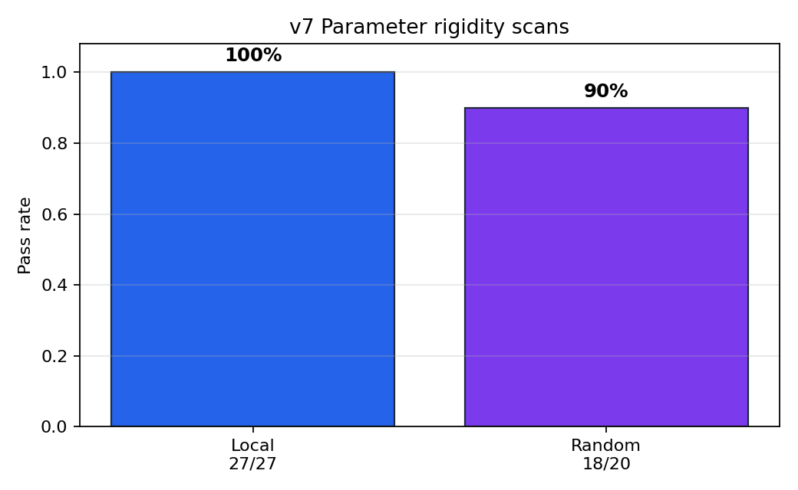

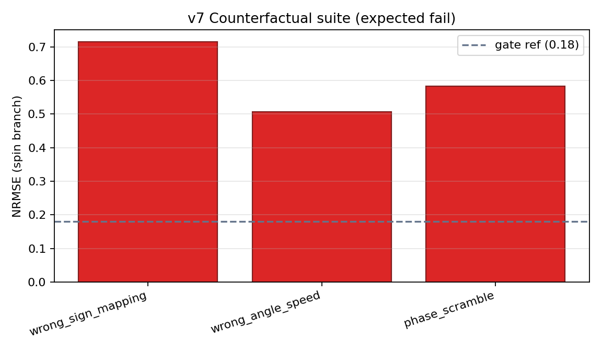

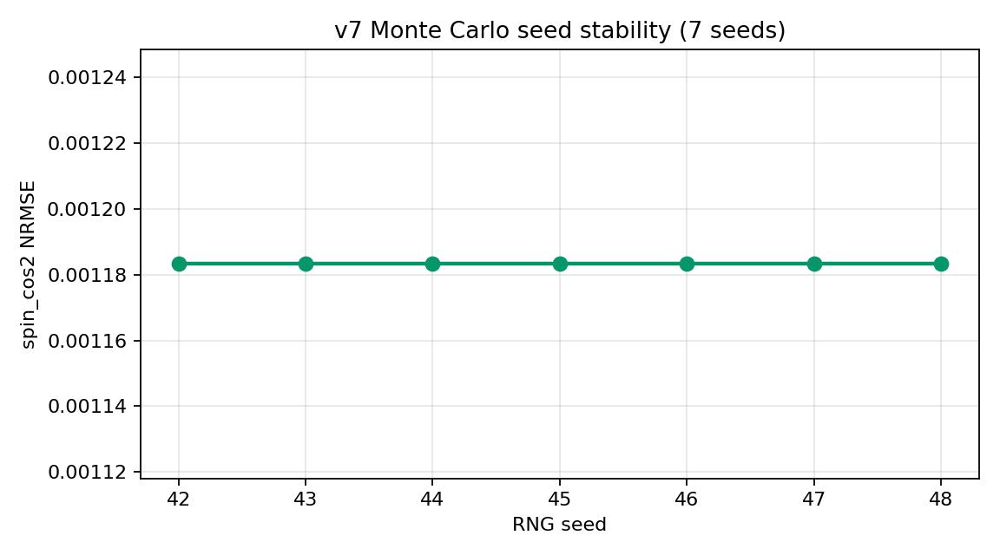

**Interpretation / 解释**  
v7 answers the identifiability question: this point is not an arbitrary fit.  
v7 回答了可辨识性问题：该参数点并非任意凑数。

---

## 5. Section v8: Cross-Scale Results / 第五节：v8 跨尺度结果

- baseline joint pass: `True`
- `radial_levels`: pass (`nrmse=0.000000`, `R2=1.000000`)
- `decoherence`: pass (`nrmse=0.052611`, `R2=0.997795`)
- `compton_shift`: pass (`nrmse=0.000000`, `R2=1.000000`)
- eta probe (`eta=0.001`): Compton expected fail
- negative controls: all expected fail
- multi-round hardening: `100/100` pass

**Interpretation / 解释**  
v8 answers the capability question: the same locked point sustains heterogeneous phenomena.  
v8 回答了功能问题：同一锁定点可支撑异质现象联合通过。

---

## 6. Robustness Closure / 稳健性封口链

1. v7 narrow feasible region (rigidity)  
2. v8 baseline pass at locked point  
3. eta counterfactual failure  
4. negative controls failure  
5. high-round hardening pass (`100/100`)

**EN**  
This chain blocks two common objections simultaneously: "only tuning" and "only isolated fit."

**中**  
该链条同时封堵两类常见质疑：“只是在调参”与“只是在单点拟合”。

---

## 7. Audit chain figures (v6+v7 context; mirrors `v7.html`) / 第七节：审计链图示（与 `v7.html` 同源）

**EN**  
The standalone **`v7.html`** manuscript is a figure-centric view of the broader audit chain (Bell → GHZ → v6 → bridges). This merged document embeds the **same primary figures** so v8 is not read in isolation. Image paths are relative to this folder (`files/`), five levels up to repository root.

**中**  
独立稿 **`v7.html`** 是以图为主的审计链总览（Bell → GHZ → v6 → 桥接图）。本合并稿**嵌入相同主图**，避免 v8 被误读为“脱离上下文的单点表演”。下图路径相对于本目录（`files/`），向上五级到仓库根目录。

<article class="card">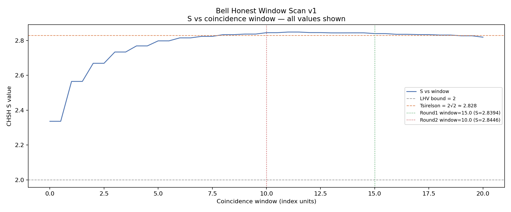
A. Bell window scan — protocol sensitivity. <code>artifacts/bell_window_scan_v1/WINDOW_SCAN_V1.png</code>
</article>
<article class="card">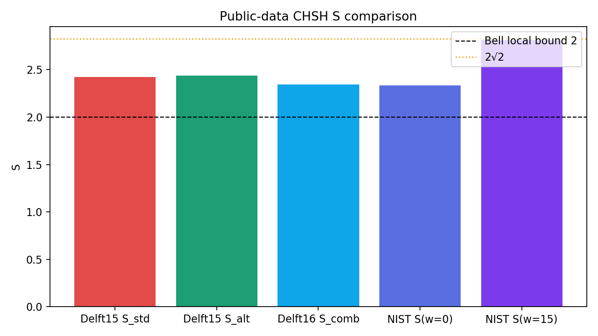
A. Public S comparison. <code>artifacts/public_validation_pack/fig1_s_comparison.png</code>
</article>
<article class="card">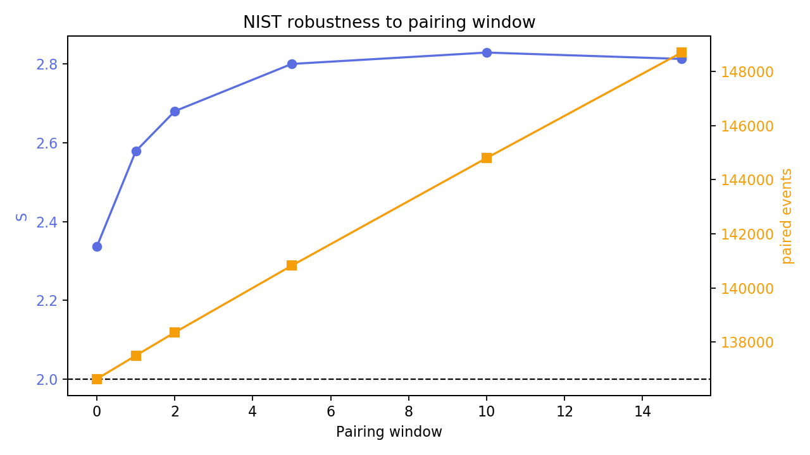
A. NIST window robustness. <code>artifacts/public_validation_pack/fig3_nist_window_robustness.png</code>
</article>
<article class="card">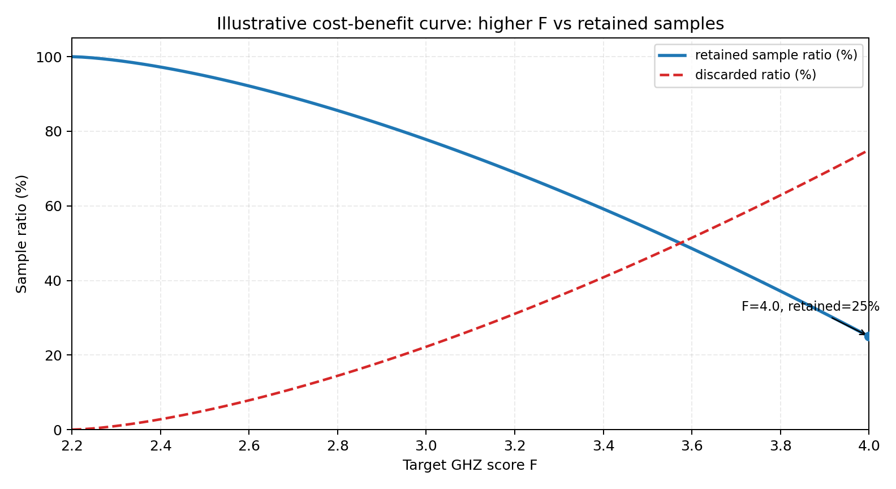
B. GHZ cost–benefit. <code>artifacts/ghz_threshold_experiment/ghz_cost_benefit_curve_2p2_to_4p0.png</code>
</article>
<article class="card">
B. GHZ threshold heatmap. <code>artifacts/ghz_threshold_experiment/ghz_threshold_mechanism_heatmap.png</code>
</article>
<article class="card">
B. GHZ V10.4 cost curve. <code>artifacts/ghz_medium_v10/V10_4_REAL_COST_CURVE.png</code>
</article>
<article class="card">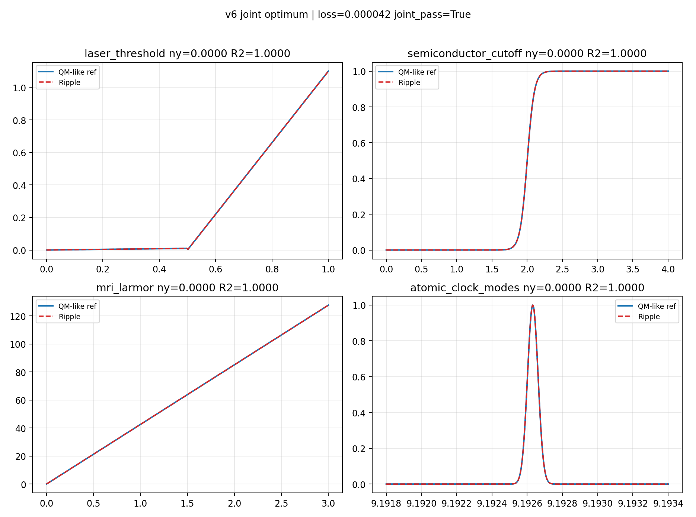
C. v6 default joint 2×2. <code>artifacts/ripple_quantum_tests_v6/RIPPLE_V6_JOINT_2x2.png</code>
</article>
<article class="card">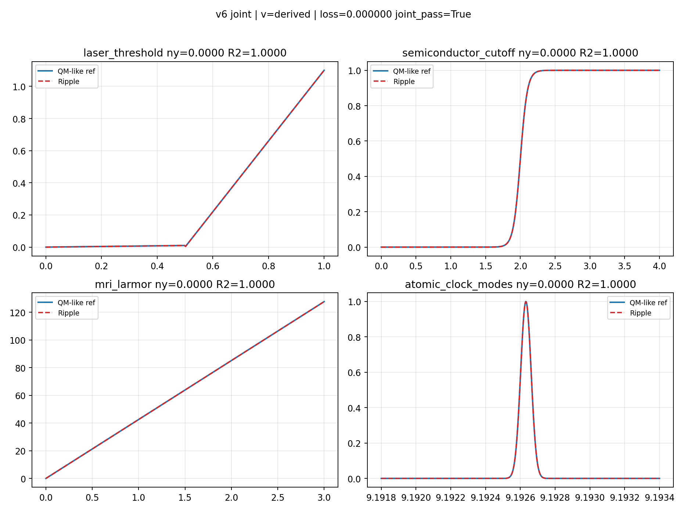
C. v6 derived α=0 branch. <code>artifacts/ripple_quantum_tests_v6_derived_alpha0/RIPPLE_V6_JOINT_2x2.png</code>
</article>
<article class="card">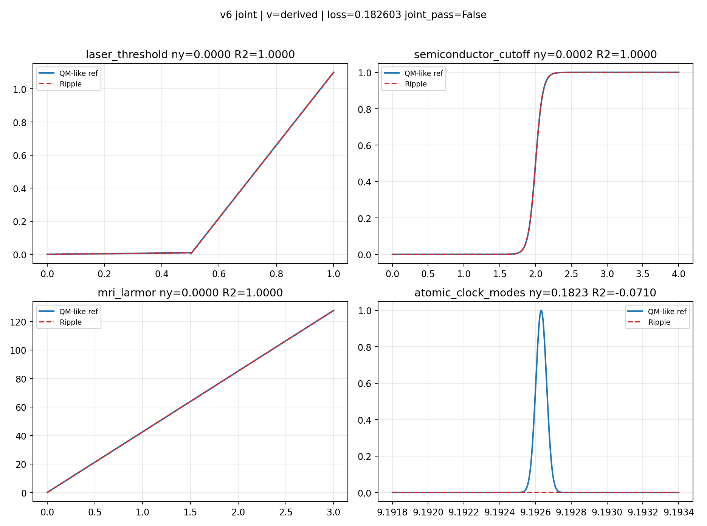
C. v6 preserved fail branch. <code>artifacts/ripple_quantum_tests_v6_derived_v2/RIPPLE_V6_JOINT_2x2.png</code>
</article>
<article class="card">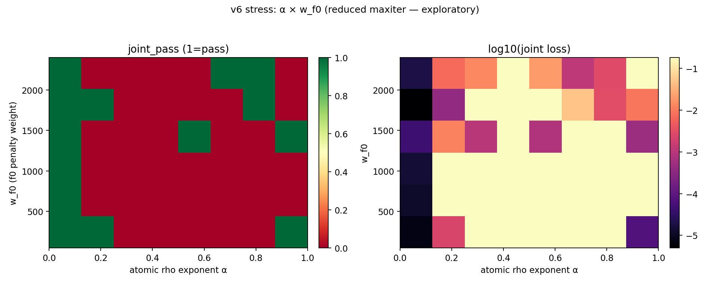
C. v6 stress 2D map. <code>artifacts/ripple_quantum_tests_v6_stress_2d_demo/RIPPLE_V6_STRESS_2D.png</code>
</article>
<article class="card">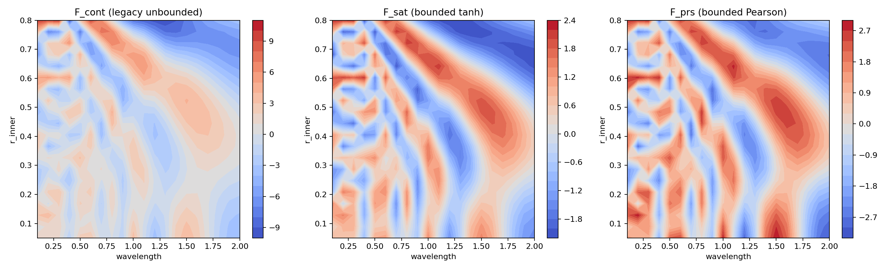
D. Three-ruler maps (bridge). <code>artifacts/ghz_medium_v10/V10_1_THREE_RULERS_MAPS.png</code>
</article>
<article class="card">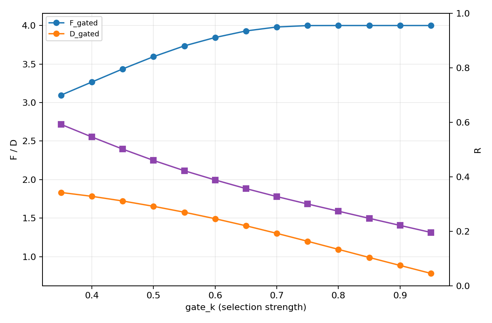
D. Selection-tax curves. <code>artifacts/ghz_medium_v10/V10_3_SELECTION_TAX_CURVES.png</code>
</article>
<article class="card">
D. NCC singles bridge. <code>artifacts/reports/ncc_singles_bridge_real.png</code>
</article>

<strong>Note / 说明：</strong> Full-screen figure manuscript: open <code>v7.html</code> in this same folder. Text + JSON for v7 metrics: <code>artifacts/ripple_quantum_tests_v7_three/</code>.

---

## 8. v8 Figure Panel / 第八节：v8 图像面板

**EN**  
The following figures are generated directly from the locked-parameter v8 script and the archived v8 JSON output.

**中**  
下列图像由锁定参数的 v8 脚本与已归档 v8 JSON 直接生成。

### Fig. 1 — Radial levels / 径向能级

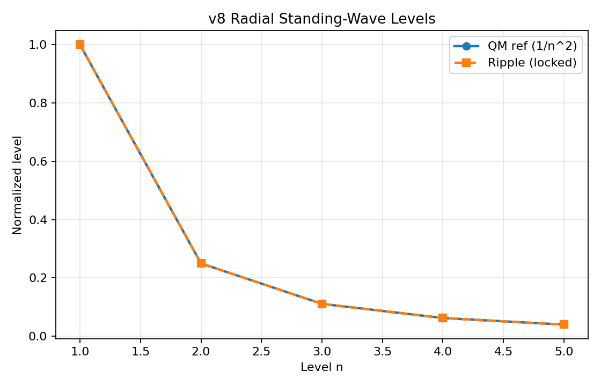

### Fig. 2 — Decoherence / 退相干

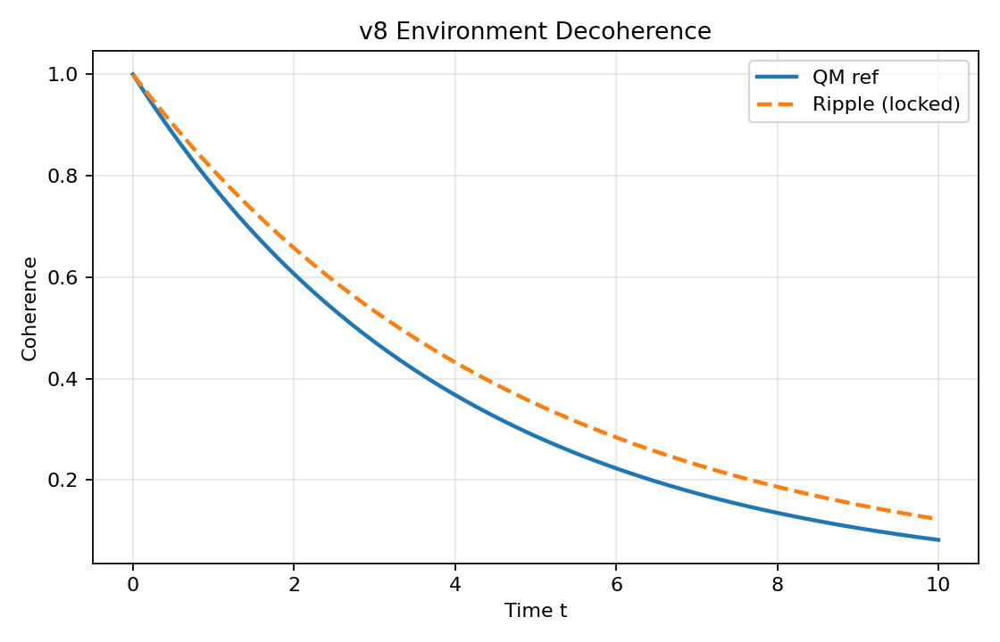

### Fig. 3 — Compton + counterfactual / Compton 与反事实

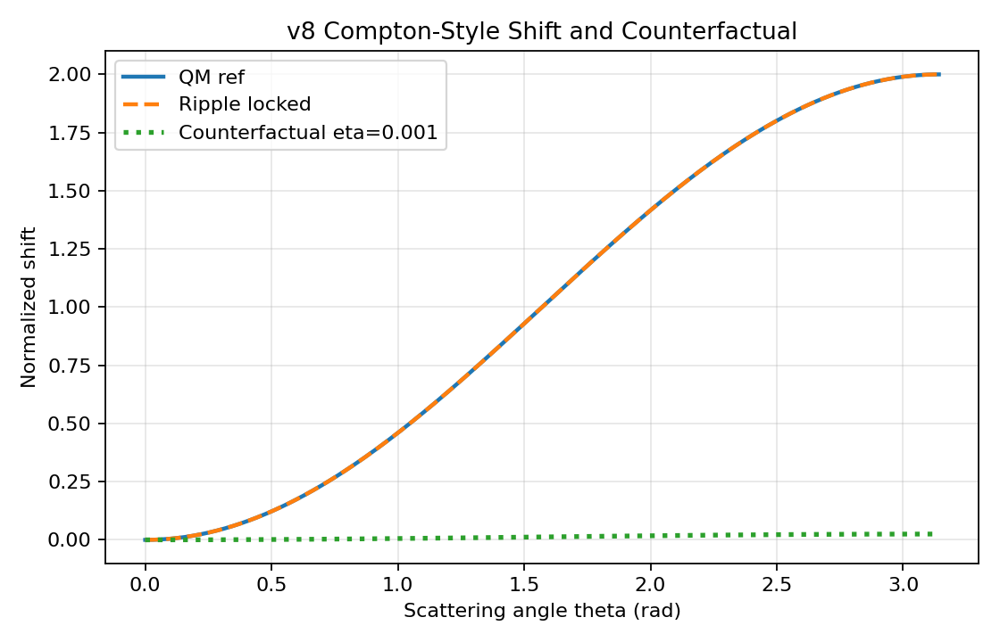

### Fig. 4 — 100-round hardening / 100轮加固

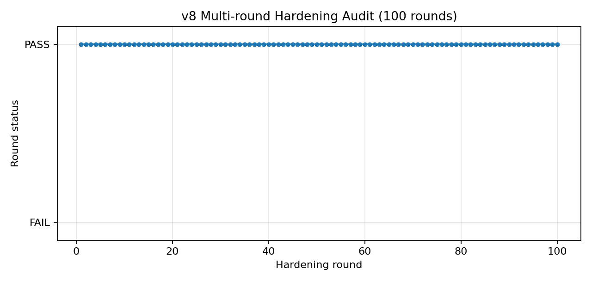

---
## 9. Boundary Statement / 边界声明

**EN**  
Claimed: auditable model-class consistency under declared gates.  
Not claimed: completed SI mapping, ontology uniqueness, direct falsification of standard QM.

**中**  
本文主张：在声明门槛下具备可审计的一致性。  
本文不主张：SI 映射已完成、唯一本体论成立、可据此直接否定标准量子理论。

---

## 10. Reproducibility / 可复现

Run from repository root:

**v6 baseline:**

`python scripts/explore/ripple_quantum_tests/ripple_quantum_tests_v6_joint.py`

**v7 metrics:** primary archive is `artifacts/ripple_quantum_tests_v7_three/RIPPLE_V7_THREE_RESULTS.json`. If the runnable script `ripple_quantum_tests_v7_three.py` is restored in your checkout, use the command recorded in `v7.html`; otherwise reproduce from the JSON and figure scripts:

`python scripts/explore/ripple_quantum_tests/generate_v7_paper_figures.py`

**v8 audit:**

`python scripts/explore/ripple_quantum_tests/ripple_quantum_tests_v8_unify.py --rounds 100 --eta-probe 0.001`

`python scripts/explore/ripple_quantum_tests/generate_v8_paper_figures.py`

**Merged HTML:**

`python scripts/explore/ripple_quantum_tests/build_merged_v7_v8_html.py`

Artifacts:
- `artifacts/ripple_quantum_tests_v6/RIPPLE_V6_JOINT_2x2.png`
- `artifacts/ripple_quantum_tests_v7_three/RIPPLE_V7_THREE_RESULTS.json`
- `artifacts/ripple_quantum_tests_v8_unify/v8_quantum_grand_unification.json`
- `artifacts/ripple_quantum_tests_v8_unify/RIPPLE_V8_UNIFY_SUMMARY.md`
- `artifacts/ripple_quantum_tests_v8_unify/V7_V8_LOCKED_AUDIT_BRIEF.md`
- `artifacts/ripple_quantum_tests_v8_unify/PARAMETER_TRAP_LIBRARY.json`
- `docs/AUDIT_PARAMETER_TRAP_LIBRARY.md`

---

## 11. Seal: Licensing, Trap Library, and Human Audit Node / 封印：许可、陷阱库与人审节点

**EN — Licensing**  
Software in this repository is under **AGPL-3.0-or-later** (`LICENSE`, `NOTICE`). Manuscripts and narrative documentation default to **CC BY-NC-ND 4.0** (`LICENSE-DOCS.md`): non-commercial use, attribution required, no derivatives. This split is intentional: strong copyleft for code; stricter protection for narrative assets. AGPL does not ban all commercial activity; it requires corresponding source to be made available when modified versions are distributed or provided over a network service. See `docs/LICENSE_AND_SEAL.md` for a plain-language summary.

**中 — 许可**  
本仓库程序源代码默认适用 **AGPL-3.0 或更高版本**（见 `LICENSE`、`NOTICE`）。论文稿与叙事性文档默认适用 **CC BY-NC-ND 4.0**（见 `LICENSE-DOCS.md`）：非商业、须署名、禁止演绎再分发。此为有意分工：代码走更强 copyleft，叙事资产走更严的 CC 条款。AGPL 并不禁止一切商业行为；它约束的是“分发或以网络服务方式提供衍生程序时须按 AGPL 提供对应源码”。平实说明见 `docs/LICENSE_AND_SEAL.md`。

**EN — Trap library**  
We publish not only the locked triplet \((1.5495,2.35,0.08)\) but also a curated list of nearby triplets that **fail** the frozen v8 gates under the same script version. This is an audit aid, not a legal proof of copying. Machine-readable table: `artifacts/ripple_quantum_tests_v8_unify/PARAMETER_TRAP_LIBRARY.json`. Human-readable guide: `docs/AUDIT_PARAMETER_TRAP_LIBRARY.md`.

**中 — 陷阱参数库**  
除公布锁定三元组 \((1.5495,2.35,0.08)\) 外，我们公开一组在**同一冻结脚本版本**下、数值上仍显“邻近”但 **v8 联合不通过** 的对照三元组，用于独立复现与审计对照。这是工程与学术上的可检验性设计，**不能**单独作为法律上的抄袭证据。机读表：`artifacts/ripple_quantum_tests_v8_unify/PARAMETER_TRAP_LIBRARY.json`；人读说明：`docs/AUDIT_PARAMETER_TRAP_LIBRARY.md`。

**EN — Human audit node**  
Acceptance gates, counterfactual probes, and round counts are **authored choices** recorded in script and artifacts. Any replication that changes the model class or gates must report a **new protocol version** and must not be silently equated with this deposit.

**中 — 人审节点**  
门槛、反事实探针与加固轮次均为**作者显式选择**，并写入脚本与归档。若复现方更改模型类或门槛，必须申报**新协议版本**，且不得与本文归档静默等同。

