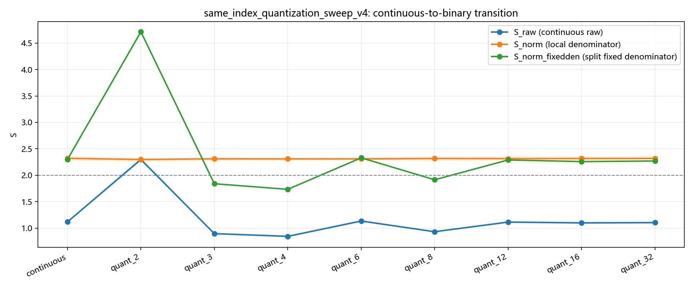
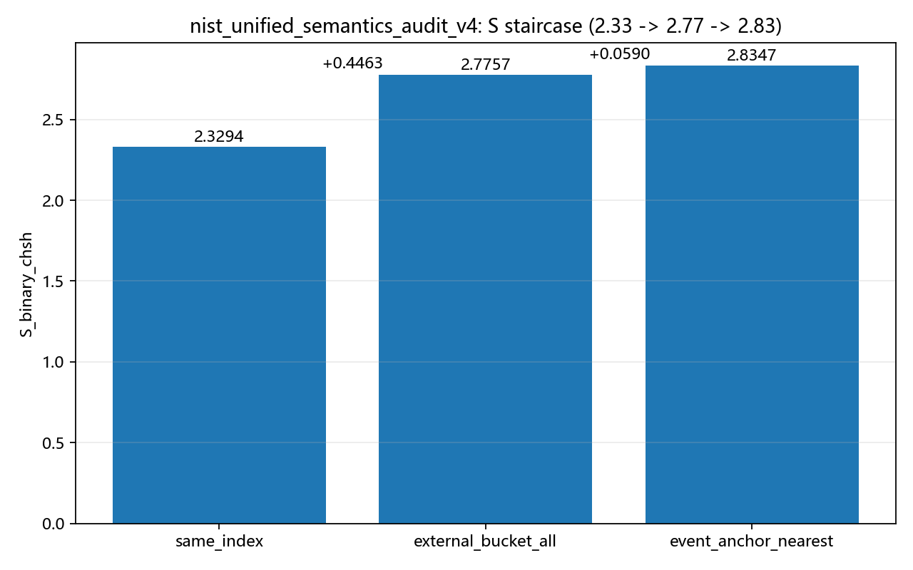
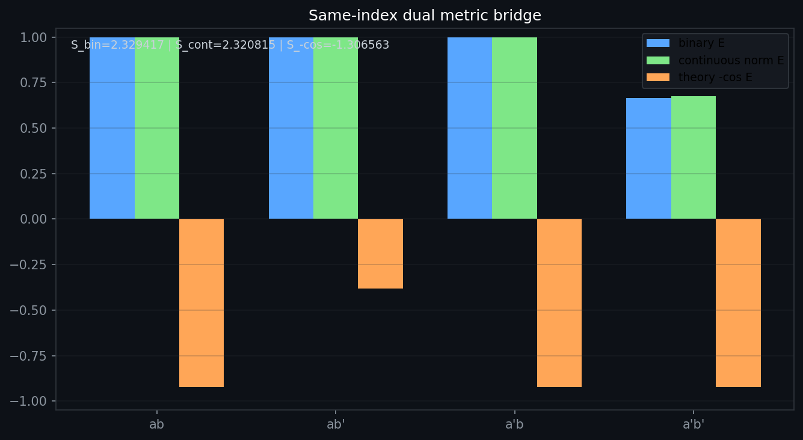

# Bell Audit (v5): How Binarization and Pairing Semantics Co-Shape CHSH Metrics

**Author**: Tom Nattle (Audit collaboration: Antigravity AI)  
**Date**: April 2026 (v5 rewrite)  
**Project**: Chain-Explosion Model  
**Positioning**: Professional manuscript for review (student-friendly edition)

---

## Abstract

This manuscript rewrites and refocuses the Bell audit around one core question: **if the underlying event stream is fixed, why can CHSH shift strongly when only binarization and pairing semantics are changed?**  
On the NIST stream, we confirm: continuous `S_raw = 1.117683`, while binarized `S_raw(quant_2) = 2.297779`; under semantic decomposition, `same_index = 2.329417`, `external_bucket_all = 2.775687`, and `event_anchor_nearest = 2.834670`.  
These results indicate that Bell headline values are shaped not only by physical mechanisms, but also by statistical pipeline definitions. We also provide an educational explanation so non-specialist readers can understand how denominator policy, pairing logic, and post-selection alter the apparent conclusion.

---

## 1. Background and Problem Definition

Bell/CHSH is often used to discuss whether classical explanations are sufficient.  
In engineering pipelines, however, the formula does not consume all raw events directly. It consumes processed, countable events:

- Step 1: discretize continuous observations (e.g., 2-level, 3-level quantization);
- Step 2: pair events under a specific time/index rule;
- Step 3: decide which pairs enter the denominator and which are discarded.

If these steps strongly influence the result, then a high `S` is partly a **pipeline-configuration effect**, not purely a direct readout of the underlying mechanism.

---

## 2. Data and Methods (v4 Re-audit Frame)

### 2.1 Data and script sources

- Result package: `battle_results/nist_clock_reference_audit_v1/results/`
- Email summary: `battle_results/nist_clock_reference_audit_v1/email_pack_v4/EMAIL_SUMMARY_v4_EN.md`
- Key scripts: `scripts/explore/nist_same_index_quantization_sweep_v4.py`, `scripts/explore/nist_unified_semantics_audit_v4.py`

### 2.2 Three evidence chains reproduced here

1. **Binarization chain**: compare continuous and 2-level outputs under the same `same_index` pairing.
2. **Semantic premium chain**: compare `same_index -> external_bucket_all -> event_anchor_nearest`.
3. **Robustness-boundary chain**: verify closure checks (anchor symmetry, bounded edge sensitivity, etc.).

### 2.3 Experimental principle (to avoid "black-box statistics" concerns)

This study does not alter the underlying event stream. It only changes the protocol that converts events into countable samples.  
Core principle: CHSH is computed from rule-filtered pairs, not from raw rows directly.

- Input layer: fixed event stream (same rows, same order);
- Representation layer: continuous vs discretized outputs (2-level, 3-level, etc.);
- Pairing layer: `same_index`, `external_bucket_all`, `event_anchor_nearest`;
- Scoring layer: same CHSH form, compared across protocols.

Therefore, this is a **protocol-sensitivity** audit, not a data replacement exercise.

---

## 3. Main Results

### 3.1 Large shift induced by binarization

In `same_index_quantization_sweep_v4`:

- Continuous: `S_raw = 1.117683` (95% CI: `1.097130 ~ 1.138496`)
- 2-level quantized: `S_raw(quant_2) = 2.297779`

Meaning: **with the same data and same pairing framework, changing representation alone can produce a large jump**.

*Figure 1: Quantization sweep under same_index semantics (v4).*

### 3.2 Semantic premium decomposition (2.33 -> 2.77 -> 2.83)

In `nist_unified_semantics_audit_v4`:

- `same_index S_binary_chsh = 2.329417`
- `external_bucket_all S_binary_chsh = 2.775687` (relative `+0.446270`)
- `event_anchor_nearest S_binary_chsh = 2.834670` (additional `+0.058983`)

This forms a protocol-premium staircase: numerical uplift appears in sync with semantic escalation.

*Figure 2: Protocol premium staircase from the v4 email package.*

### 3.3 Closure boundaries (to prevent over-interpretation)

In `nist_revival_20pct_closure_v4`:

- `same_index_not_near_2p82 = True`
- `pure_bucket_in_2p8_zone = True`
- `anchor_asymmetry_small = True` (`delta_abs = 0.001356`)
- `edge_sensitivity_bounded = True`

Interpretation: the `~2.8` zone is not a natural extension of `same_index`; it is tied to specific semantic layers.

*Figure 3: Dual-metric bridge under same_index, showing non-identity between metric views.*

### 3.4 Key numeric table (reviewer quick scan)

- Fixed-stream pair count: `pair_count = 128016`
- Continuous metric: `S_raw = 1.117683` (95% CI: `1.097130 ~ 1.138496`)
- 2-level metric: `S_raw(quant_2) = 2.297779`
- Semantic staircase: `2.329417 -> 2.775687 -> 2.834670`
- Stair increments: `+0.446270` and `+0.058983`
- Anchor symmetry difference: `delta_abs = 0.001356`

---

## 4. Student-Friendly Explanation: Why does this happen?

You can treat CHSH like a score:

- Numerator: pairs that satisfy certain pattern rules;
- Denominator: total pairs allowed into the statistic.

If you change which items are counted in the total (denominator policy), or first force continuous values into pass/fail bins (binarization), the final average can change a lot.  
So this paper does not claim that one theory is fully overthrown. It argues that **data-processing protocol must be audited as seriously as the physical model**.

---

## 5. Conclusions and Review Recommendations

### 5.1 Conclusions within scope

1. Bell metrics on this stream show strong **binarization sensitivity**.  
2. Bell metrics on this stream also show strong **pairing-semantics sensitivity**.  
3. Therefore, headline `S` claims should always publish denominator logs, semantic definitions, and counterfactual controls together.

### 5.2 Recommendations for follow-up review

- Report inclusion rules with every headline `S` value;
- Provide at least one side-by-side comparison between `same_index` and a more aggressive semantic mode;
- Require closure checks to avoid mistaking protocol premium for mechanism inevitability.

---

## 6. Minimal Reproducibility Path

Run from repository root:

`python scripts/explore/nist_same_index_quantization_sweep_v4.py`

`python scripts/explore/nist_unified_semantics_audit_v4.py`

`python scripts/explore/nist_revival_20pct_closure_v4.py`

Core outputs:

- `battle_results/nist_clock_reference_audit_v1/results/same_index_quantization_sweep_v4.json`
- `battle_results/nist_clock_reference_audit_v1/results/nist_unified_semantics_audit_v4.json`
- `battle_results/nist_clock_reference_audit_v1/results/nist_revival_20pct_closure_v4.json`

---

## 7. Boundary Statement

This is a **methodological audit manuscript**: it demonstrates that statistical conclusions are strongly protocol-dependent.  
It does **not** claim final ontology-level victory of any single theory.  
Stronger claims require cross-platform, cross-dataset, and cross-device joint validation.

---

## 8. Anticipated Reviewer Questions and Responses

**Q1: Is this just data cherry-picking?**  
A: No. The event stream is fixed; only quantization and pairing semantics are varied, with closure checks reported.

**Q2: Are favorable metrics selectively reported?**  
A: No. Continuous, binarized, and multi-semantic outputs are presented together, including low-value regions and explicit deltas.

**Q3: Does the ~2.8 zone imply mechanism inevitability?**  
A: No. Closure evidence shows this zone is tied to specific semantic modes, not an unavoidable extension of `same_index`.

**Q4: Does this paper falsify standard quantum theory?**  
A: No. This is a methodological audit showing protocol sensitivity; ontology-level claims require broader independent validation.

